# Implement B2C Self-Service Registration with Okta

A hands-on Okta lab demonstrating customer self-service registration (SSR) with a custom required attribute, MFA enrollment policy, and an inline hook that validates registration data against an external service before an account is created.

---

## Overview

This lab extends a previously configured Customer Rewards SPA into a full self-service registration flow: new customers can sign themselves up for an account, but only if they supply a valid invitation code that a Registration Inline Hook validates against an external endpoint in real time. The lab also configures an authenticator enrollment policy so newly registered customers are required to set a password and optionally enroll in Google Authenticator.

The build demonstrates a reusable pattern: **custom profile attribute → self-service registration policy → authenticator enrollment policy → inline hook validation → verified allow/deny outcomes**. This pattern applies broadly to B2C and CIAM use cases where organizations need to gate self-registration behind business logic that lives outside of Okta — invitation codes, eligibility checks, fraud screening, or third-party verification.

---

## Business Problem

Consumer-facing applications that allow self-service sign-up need more control than a plain "anyone can register" flow provides:

- Registration should only succeed for users who meet a business condition (in this case, holding a valid invitation code) — decided by logic outside of Okta
- Newly registered users need to be routed into the correct group and application access model automatically, with no manual admin step
- The required data collected at registration should be centrally defined and enforced consistently, not hardcoded into the application
- Both the "deny" and "allow" paths need to be verifiable — confirming a bad submission is actually rejected, not just assuming validation works

This lab demonstrates how to solve this using Okta's User Profile Policies, a custom Profile Editor attribute, an Authenticator Enrollment Policy, and a Registration Inline Hook.

---

## What I Built

### 1. Codespace and App Configuration Sync
Updated the existing Customer Rewards SPA's sign-in/sign-out redirect URIs and the org's Trusted Origin to match a new Codespace session, and extended the relevant GitHub Codespaces secrets (`REWARDS_CLIENT_ID`, `BASE_OKTA_URL`) to this lab's repository.

**Key concept:** Codespace-hosted labs generate a new, randomized URL on every session — any app integration or Trusted Origin tied to a previous Codespace URL will silently break until it's updated to match the new session's URL.

### 2. Authenticator Enrollment Policy
Created an authenticator enrollment policy (`Customer policy`) scoped to the Customers group, requiring Password and making Google Authenticator optional, with all other authenticators disabled. Added a policy rule scoping enforcement to the Customer Rewards application specifically.

**Key concept:** Authenticator enrollment policy and password policy are evaluated together — an authenticator marked "Disabled" in the enrollment policy can still be prompted if a password policy configuration requires it, so policy layers need to be checked holistically, not in isolation.

### 3. Custom Profile Attribute — Invitation Code
Added a new custom attribute (`invite_code`, string, required, Read-Write) to the default User profile in the Profile Editor, to hold the invitation code supplied at registration.

### 4. User Profile Policy with Self-Service Registration
Created a User Profile Policy (`Customer policy`) with Self-Service Registration set to Allowed, automatically assigning new registrants to the Customers group. Verified that the custom `invite_code` attribute automatically appeared as a required field on the profile enrollment form, and assigned the Customer Rewards application to this policy.

**Key concept:** Fields added to the default User profile in the Profile Editor automatically propagate to the profile enrollment form — there's no separate step to "add" the field to the sign-up form itself.

### 5. Baseline Self-Service Registration Test
Verified the sign-up flow end-to-end before adding any external validation: confirmed the Sign Up link appeared, the registration form correctly required First name, Last name, Email, and Invitation Code, and that a new user could complete registration and land on the Customer Rewards application.

### 6. Registration Inline Hook
Created a Registration Inline Hook (`Invitation Code Validation`) pointing to an external validation endpoint, authenticated via a custom HTTP header, and attached it to the User Profile Policy's Profile Enrollment settings so it fires whenever a new user is created.

**Key concept:** A Registration Inline Hook is a synchronous outbound call — Okta pauses account creation, sends the submitted profile data to the external endpoint, and only proceeds with (or rejects) account creation based on that endpoint's response, rather than validating anything itself.

---

## Verification

Tested the complete self-service registration flow, including both a rejected and an accepted registration attempt after the inline hook was active, confirming the external validation logic correctly gated account creation:

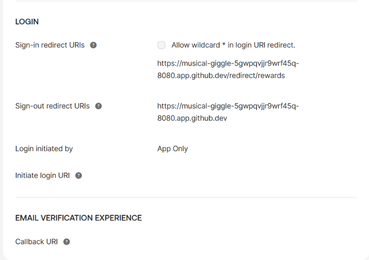
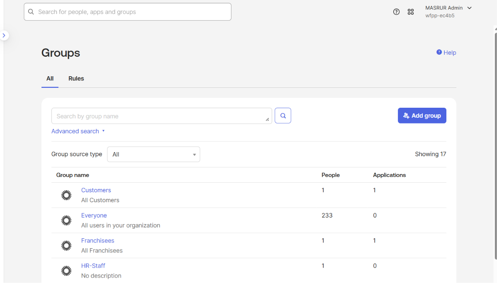
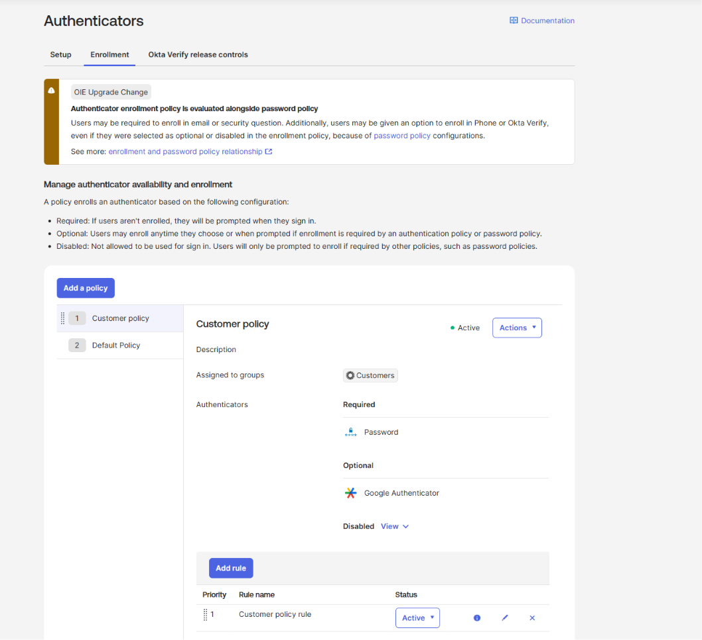
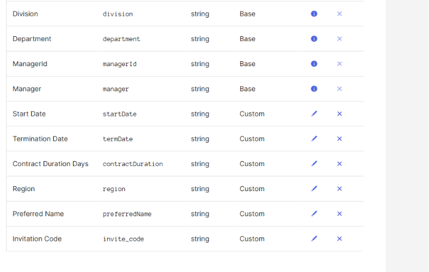
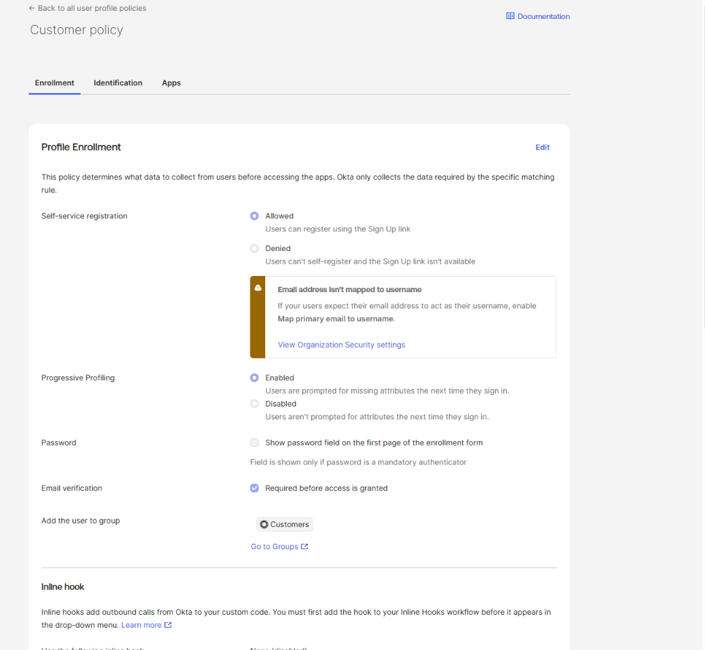
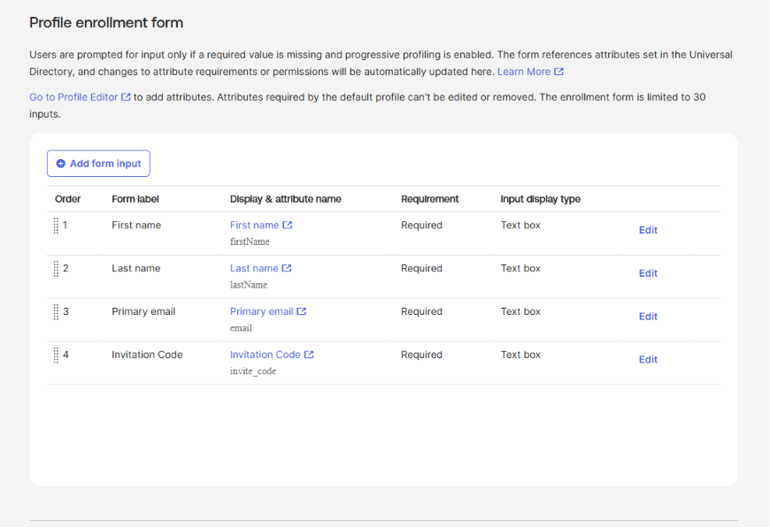
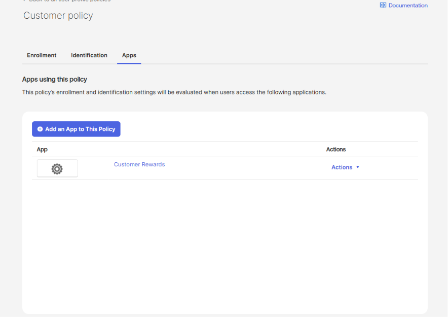
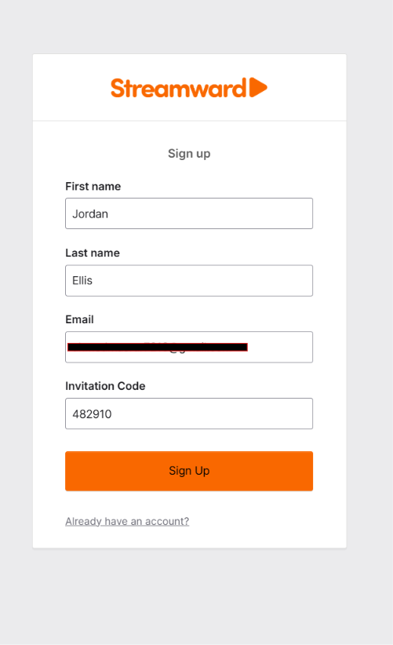
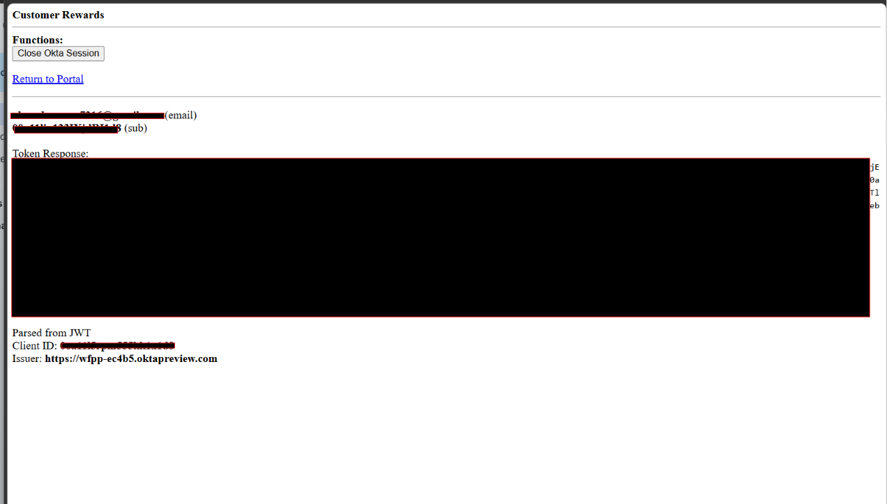
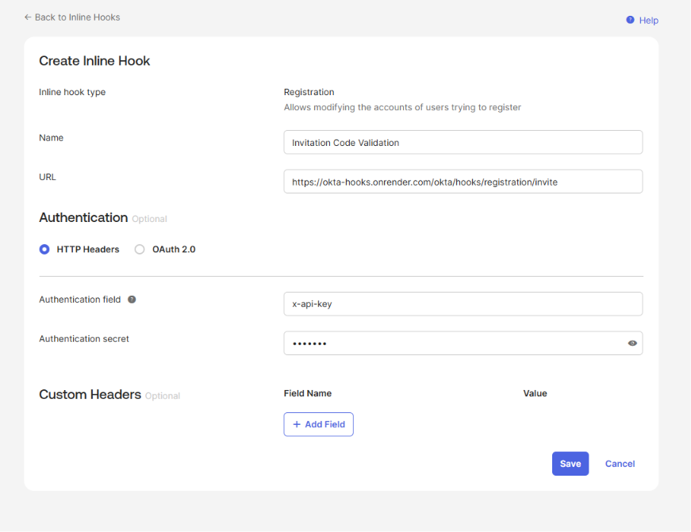
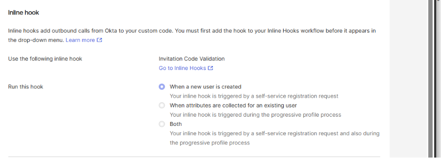
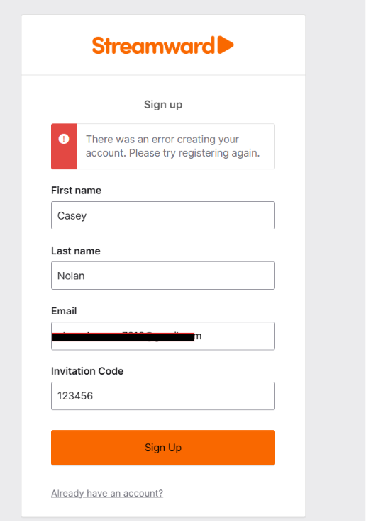
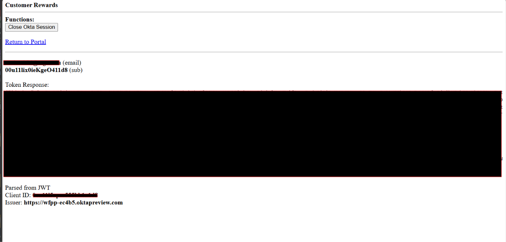

**Verification steps performed:**
1. Confirmed the Customer Rewards app's redirect URIs and the org's Trusted Origin were updated to match the active Codespace session
2. Confirmed the authenticator enrollment policy and its rule were correctly scoped to the Customers group and the Customer Rewards app
3. Confirmed the `invite_code` custom attribute automatically appeared as a required field on the profile enrollment form
4. Completed a baseline registration (without the inline hook active) to confirm the self-service sign-up flow worked end-to-end
5. Attached the Registration Inline Hook and submitted a registration with an invalid invitation code — confirmed Okta rejected account creation with an error
6. Submitted a second registration with a valid invitation code — confirmed the account was created successfully and the user landed on Customer Rewards with a valid token

---

## Key Skills Demonstrated

- Okta Self-Service Registration (SSR) configuration via User Profile Policies
- Custom Profile Editor attributes and their automatic propagation to enrollment forms
- Authenticator Enrollment Policies, including the distinction between Required, Optional, and Disabled authenticators
- Registration Inline Hooks for real-time, externally validated account creation logic
- Maintaining Codespace-dependent app configuration (redirect URIs, Trusted Origins) across ephemeral development sessions
- End-to-end testing methodology: verifying both a deny path and an allow path for externally validated business logic, not just the happy path

---

## Tools & Environment

- **Platform:** Okta (Okta Integrator Free Plan / Preview org)
- **Okta features used:** User Profile Policies, Self-Service Registration, Profile Editor (custom attributes), Authenticator Enrollment Policies, Registration Inline Hooks
- **External service:** A hosted inline hook validation endpoint for invitation code verification
- **Development environment:** GitHub Codespaces running the lab's sample portal application
- **Test methodology:** Live self-service registration testing across three scenarios — no external validation, invalid invitation code, and valid invitation code — with email verification completed using a real inbox

---

## Real-World Relevance

This pattern mirrors production B2C/CIAM configurations used to:

- Gate self-service account creation behind business rules that live outside the identity provider — invitation codes, eligibility criteria, fraud or risk scoring
- Collect and enforce custom, business-specific required profile data as part of registration, without custom application code
- Automatically route newly registered users into the correct access model (groups, applications, authenticator requirements) with no manual provisioning step
- Demonstrate the building blocks behind larger CIAM registration flows, where inline hooks integrate Okta with external systems of record, eligibility services, or fraud detection platforms

---

## Related Projects

- [Sign in Your Users and Secure Sessions with Okta](../sign-in-users-and-secure-sessions) — SPA integration, group-based RBAC, and the Redirect model of authentication
- [Brand Your Okta Customer Identity Experience](../brand-your-oci-experience) — Custom branding and API-based theme management
- [Okta Workflows — Use Helper Flows to Process Lists](../use-helper-flows-to-process-lists) — Time-based, self-expiring group access using event-driven flows and scheduled orchestration
- [Okta Network Security Policies](../network-security-policies) — IP Zones, Dynamic Zones, and Authentication Policy rules for context-aware access control

---

*Part of an ongoing IAM portfolio built using Okta Identity Engine.*
