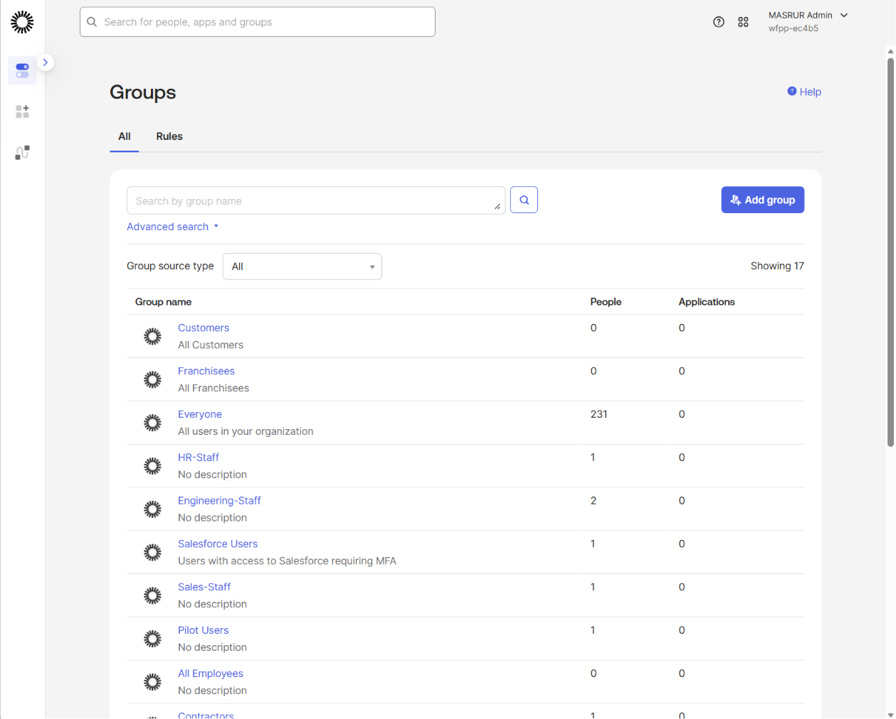
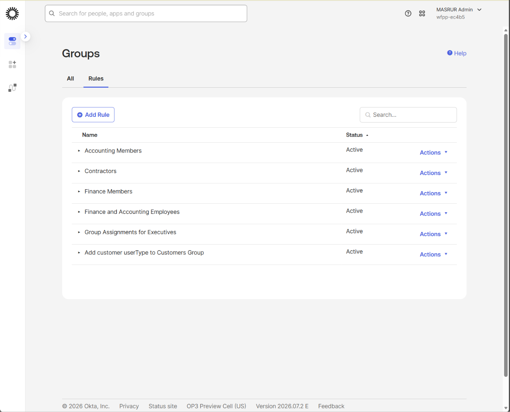
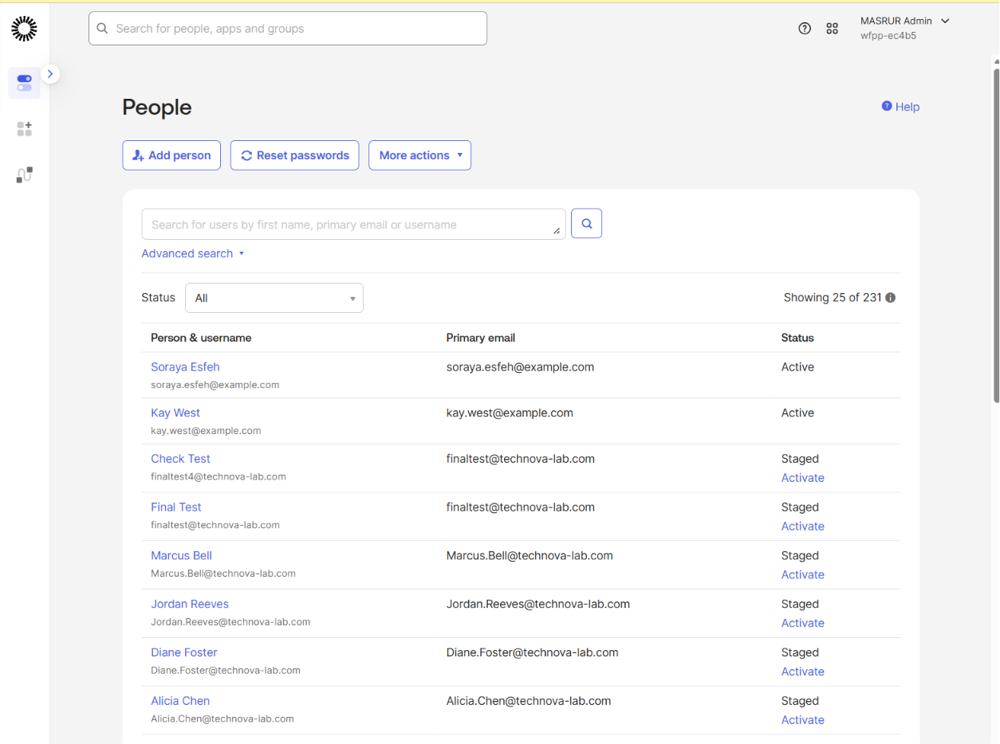
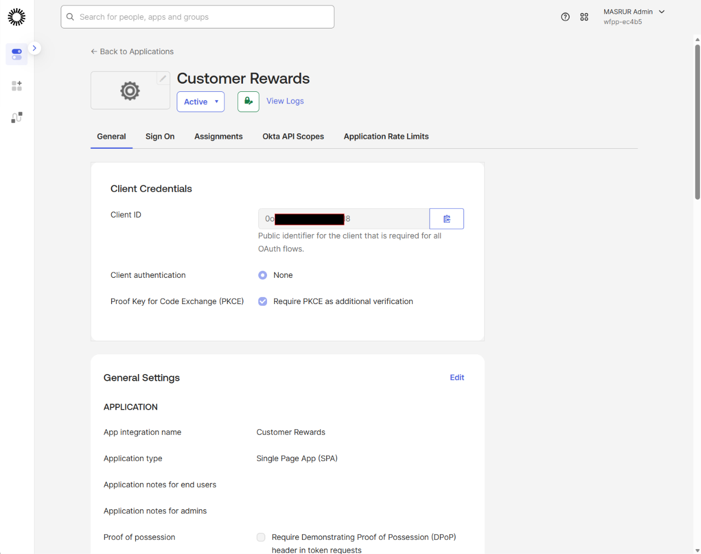
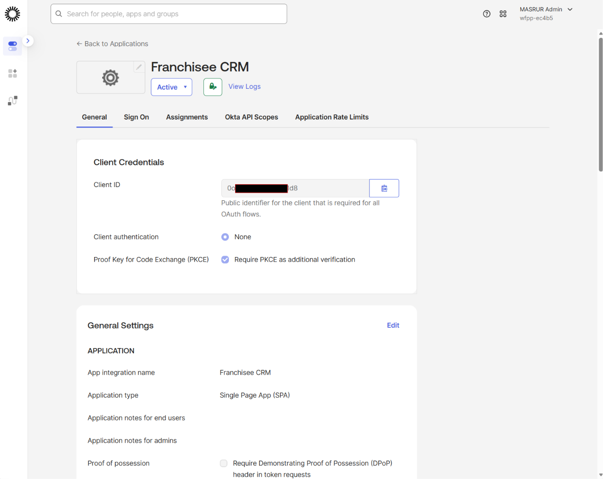
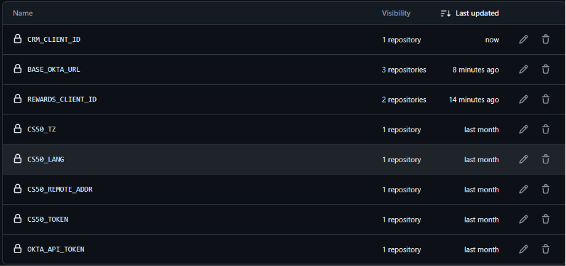
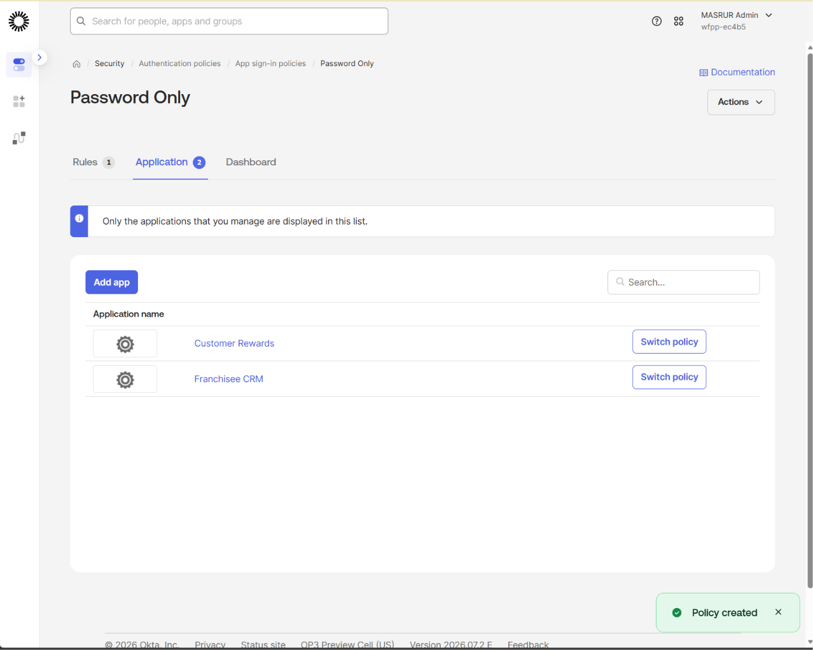
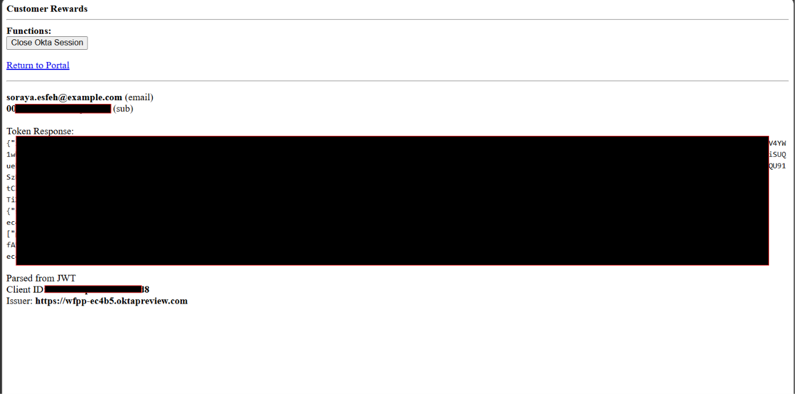

# Sign in Your Users and Secure Sessions with Okta

A hands-on Okta lab demonstrating SPA integration via the Application Integration Wizard, group-based RBAC, and the Redirect model of authentication using the Okta-hosted Sign-In Widget.

---

## Overview

This lab builds two Single-Page Applications that share a single Okta org but enforce strict, group-based access control: a Customer-facing Rewards app and a Franchisee-facing CRM app. Each app is scoped so that only the correct user population can authenticate into it, using Okta Groups, a Group Rule for automatic membership, and an Authentication Policy applied per app.

The build demonstrates a reusable pattern: **group segmentation → automatic membership assignment → per-app authentication policy → redirect-based OIDC login → verified access boundaries**. This pattern applies broadly across IAM use cases where different user populations (customers, partners, employees, contractors) need access to different applications from a shared identity provider.

---

## Business Problem

Organizations serving multiple distinct user populations from one identity provider need to guarantee that access boundaries are enforced by policy, not by convention:

- Customers should reach customer-facing applications only
- Partners/franchisees should reach partner-facing applications only
- New users with the correct attribute (e.g., `userType`) should be assigned to the right group automatically, without manual admin intervention
- Cross-origin browser calls to the Okta API (e.g., session termination on logout) must be explicitly trusted
- Access boundaries must be verifiable end-to-end, not just configured

This lab demonstrates how to solve this using Okta Groups, Group Rules, Authentication Policies, and OIDC SPA integrations — with no custom backend authorization logic.

---

## What I Built

### 1. Okta Groups and Automatic Membership
Created two groups, **Customers** and **Franchisees**, to represent the two distinct user populations. Added a Group Rule (`Add customer userType to Customers Group`) that evaluates the `userType` user attribute and automatically assigns any user with `userType = customer` into the Customers group.

**Key concept:** Group Rules only evaluate attribute conditions — group membership isn't guaranteed at user creation time if the rule hasn't yet processed the new user, so verifying actual membership after creation is a necessary check, not an assumption.

### 2. Test Users
Created two test users representing each population: **Kay West** (Franchisees) and **Soraya Esfeh** (Customers), each with a manually set password and no forced password change, to simplify repeatable login testing.

### 3. Trusted Origin (CORS)
Added a CORS-type Trusted Origin for the lab's Codespace-hosted portal URL, allowing browser-based JavaScript calls to the Okta API (specifically, session termination on logout) to succeed instead of being blocked by the browser's same-origin policy.

**Key concept:** CORS Trusted Origins are required even when using the Redirect model (not the embedded Sign-In Widget), because client-side logout still calls Okta's API directly from the browser.

### 4. Two SPA App Integrations with Group-Scoped Assignment
Created two OIDC Single-Page Application integrations via the Application Integration Wizard:
- **Customer Rewards** — assigned exclusively to the Customers group
- **Franchisee CRM** — assigned exclusively to the Franchisees group

Each app was configured with sign-in and sign-out redirect URIs pointing to the lab's Codespace-hosted portal, and PKCE enabled by default for the public client type.

**Key concept:** Assignment scope (`Limit access to select groups`) is the mechanism that prevents a Customer from even attempting to authenticate into the Franchisee app, independent of any authentication policy.

### 5. Password Only Authentication Policy
Created a single Authentication Policy (`Password Only`) with its Catch-all Rule requiring just the Password factor, and applied it to both app integrations.

**Key concept:** An Authentication Policy governs *how* a user authenticates once assignment already permits *that* they can attempt to; both layers (assignment + policy) work together to fully define the access boundary.

### 6. GitHub Codespaces Secrets
Configured `REWARDS_CLIENT_ID`, `CRM_CLIENT_ID`, and `BASE_OKTA_URL` as Codespaces secrets so the sample portal app could authenticate against the correct Okta org and app Client IDs without hardcoding values into source.

---

## Access Control Verification

Tested the full redirect authentication flow end-to-end for both user populations, confirming group-based access boundaries were enforced correctly in both directions:

**Verification steps performed:**
1. Confirmed both groups existed with correct membership and the Group Rule showed as Active
2. Confirmed both test users were Active, with Soraya correctly auto-assigned (or manually verified) into Customers
3. Logged in as Soraya (Customers) — confirmed successful authentication and token issuance into Rewards, and confirmed Access Denied when attempting CRM
4. Logged in as Kay (Franchisees) — confirmed successful authentication and token issuance into CRM, and confirmed Access Denied when attempting Rewards

---

## Key Skills Demonstrated

- Okta Application Integration Wizard for OIDC SPA (Single-Page Application) integrations
- Redirect model of authentication using the Okta-hosted Sign-In Widget
- Group-based RBAC using Okta Groups and Group Rules with attribute-based conditions
- CORS Trusted Origin configuration for browser-based calls to the Okta API
- Authentication Policies scoped to specific applications, independent of group assignment
- GitHub Codespaces secrets management for securely injecting Client IDs and org URLs into a sample app
- End-to-end access control verification: testing both the "allowed" and "denied" path for each user population, not just the happy path

---

## Tools & Environment

- **Platform:** Okta (Okta Integrator Free Plan / Preview org)
- **Okta features used:** Groups, Group Rules, Application Integration Wizard (OIDC SPA), Trusted Origins (CORS), Authentication Policies
- **Development environment:** GitHub Codespaces running the lab's sample portal application
- **Test methodology:** Live login testing via the Redirect model for two distinct users in two distinct groups, verifying both successful authentication and correct denial for out-of-scope app access

---

## Real-World Relevance

This pattern mirrors production IAM configurations used to:

- Serve multiple distinct user populations (customers, partners, employees) from a single Okta org without cross-population access leakage
- Automate group membership assignment based on directory attributes rather than manual admin action
- Enforce access boundaries at two independent layers — application assignment and authentication policy — for defense in depth
- Provide an auditable, testable configuration where access boundaries can be verified directly rather than assumed

---

## Related Projects

- [Okta Workflows — Use Helper Flows to Process Lists](../use-helper-flows-to-process-lists) — Time-based, self-expiring group access using event-driven flows and scheduled orchestration
- [Okta Network Security Policies](../okta-network-security-policies) — IP Zones, Dynamic Zones, and Authentication Policy rules for context-aware access control
- [Okta IAM Lifecycle Automation](#) — JML workflow automation using Okta Workflows and the Okta API

---

*Part of an ongoing IAM portfolio built using Okta Identity Engine.*
