# Brand Your Okta Customer Identity Experience

A hands-on Okta lab demonstrating custom brand configuration applied to the Okta-hosted Sign-In Widget and error pages, plus programmatic retrieval and management of branding settings via the Okta Brands API.

---

## Overview

This lab builds a fully custom brand ("Alglen's Scoop Shop") in Okta, applying a custom logo, favicon, background image, and color palette to the Okta-hosted sign-in experience. Beyond the Admin Console configuration, the lab uses the Okta Brands API directly to retrieve brand and theme metadata, then performs a full theme replacement (reset to Okta defaults, then restore to custom) using the `PUT` endpoint — demonstrating that branding is a fully API-manageable resource, not just a UI-only setting.

The build demonstrates a reusable pattern: **brand creation → theme customization → API-based retrieval → API-based theme replacement**. This pattern applies broadly to organizations that need to manage branding programmatically — for example, as part of a CI/CD pipeline, multi-tenant provisioning, or a disaster-recovery process for restoring known-good branding configurations.

---

## Business Problem

Organizations presenting a branded identity experience to customers need that branding to be both configurable through an admin UI and manageable as code:

- Marketing/design teams need a straightforward way to apply logo, colors, and imagery without engineering involvement
- Engineering teams need the same branding settings to be retrievable and updatable via API, for automation, backups, or environment promotion
- Changes need to be verifiable — confirming that a theme update actually took effect, not just assuming the API call succeeded
- Teams need a safe way to test destructive-looking changes (like reverting to defaults) with a clear, repeatable path back to the known-good configuration

This lab demonstrates how to solve this using Okta's Brands API alongside the standard Admin Console branding UI.

---

## What I Built

### 1. GitHub Codespaces Secrets
Configured `BASE_OKTA_URL` and `OKTA_API_TOKEN` as Codespaces secrets scoped to this lab's repository, allowing the Codespace terminal to authenticate against the Okta Brands API without hardcoding credentials into any file.

**Key concept:** Secrets shared across multiple lab repositories (like `BASE_OKTA_URL`) need their value kept in sync with whichever Okta org is actually in use — a stale value from a previous lab silently breaks API calls with no obvious error pointing back to the secret itself.

### 2. Custom Brand — Alglen's Scoop Shop
Created a new Brand in Okta (**Customizations → Brands**), separate from the org's default brand, to hold a fully custom visual identity.

### 3. Theme Customization
Configured the brand's Theme with a custom logo, favicon, and background image, along with a primary color (`#3F59E4`) and secondary color (`#B6C9FF`). Verified the branding rendered correctly across the Sign-in page, Error page, and Email previews before publishing.

**Key concept:** A brand's Theme is a distinct sub-resource from the Brand itself — the Brand is the container (with its own API endpoints), while the Theme holds the actual visual configuration and is retrieved and updated through its own nested endpoint.

### 4. Okta API Token
Generated a Super Admin-scoped API token (`Okta Lab`) for use in this lab's terminal-based API calls, stored securely as a GitHub Codespaces secret rather than left in plaintext in any script or file.

### 5. Brands API — List and Retrieve
Used the Brands API (`GET /api/v1/brands`) to confirm both the custom brand and the org's default brand existed, then retrieved the full theme configuration for the custom brand (`GET /api/v1/brands/{brandId}/themes`) — confirming the API-visible state matched what was configured in the Admin Console (colors, image URLs, touchpoint variants).

**Key concept:** Every setting visible in the Admin Console UI (logo, colors, per-page touchpoint variants) is also readable and writable through the API — the UI is a convenience layer over the same underlying resource.

### 6. Brands API — Full Theme Replacement
Used the theme's `PUT` endpoint to perform two full replacements: first reverting the theme to Okta's default look (no custom logo/colors), then restoring the custom branding — verifying both changes directly in the Admin Console between API calls.

**Key concept:** The theme endpoint's `PUT` method is a full replacement, not a partial patch — every field must be supplied in the request body, or it will be overwritten with the request's values rather than left as-is.

---

## Verification

Tested the full configuration and API-management flow end-to-end, confirming both the Admin Console UI and direct API calls reflected consistent, correct state at every step:

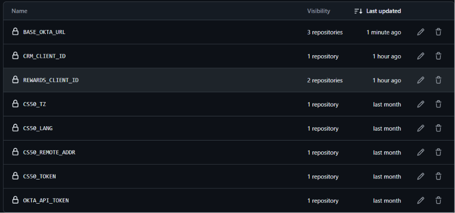
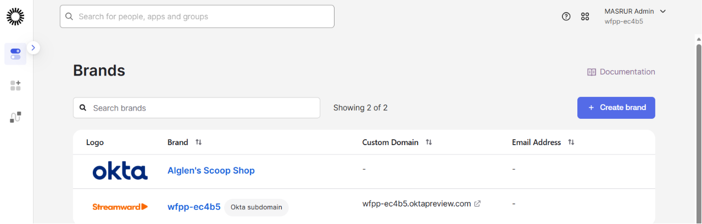
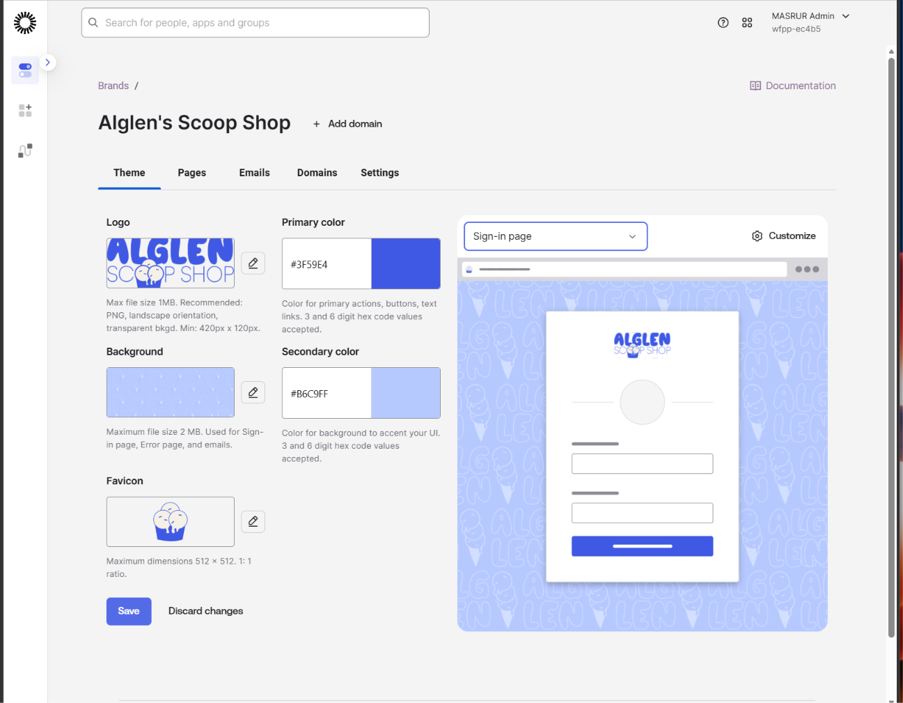
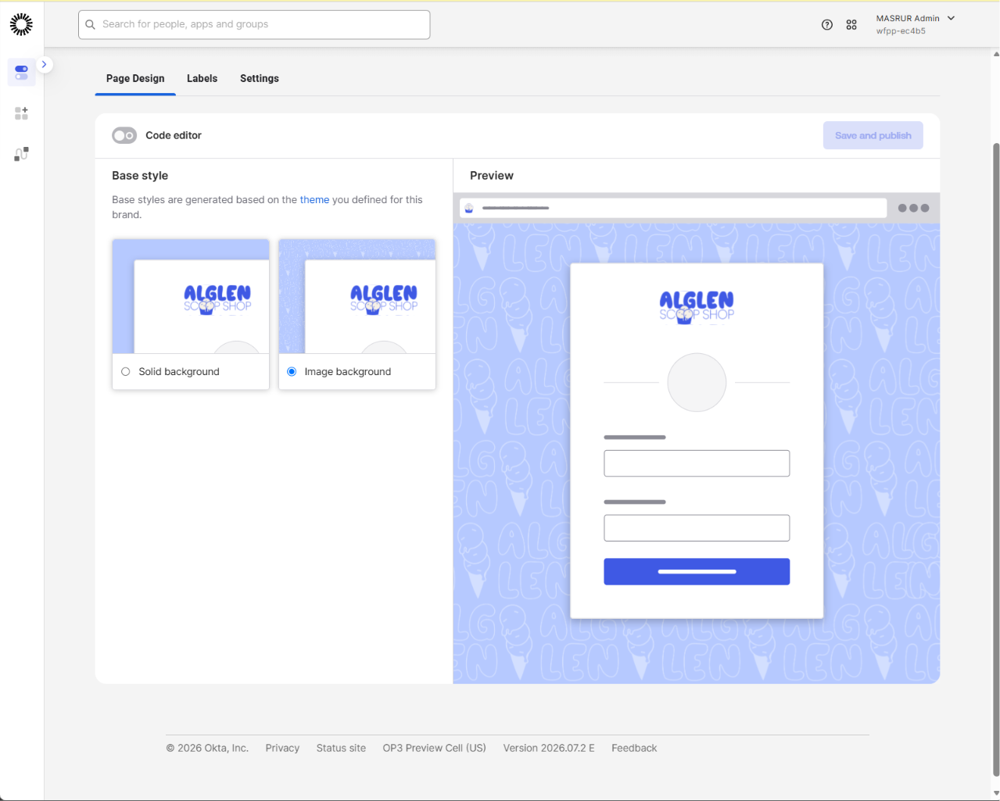
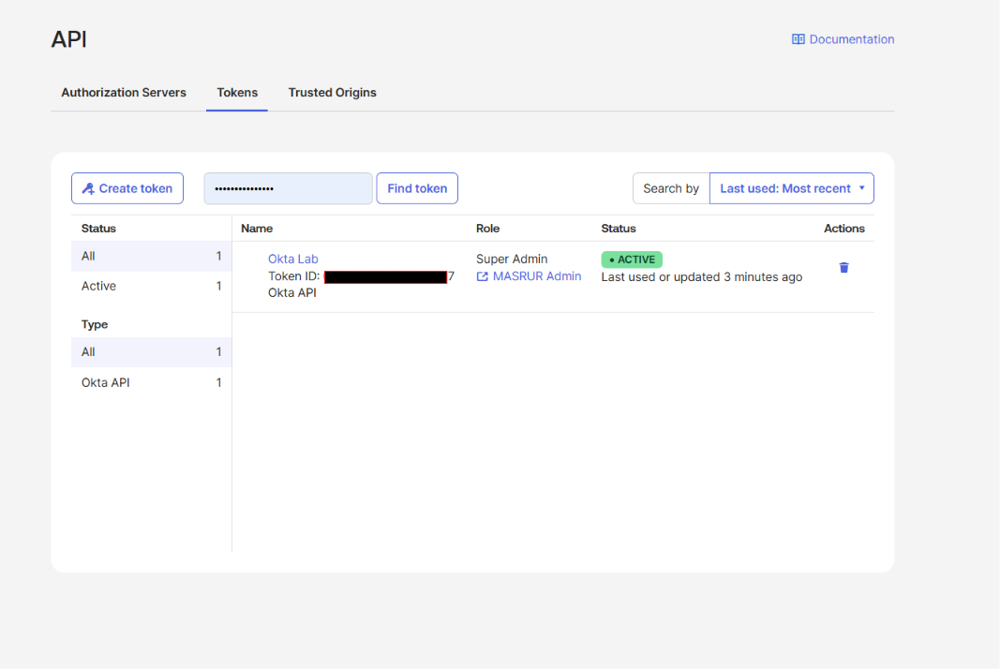
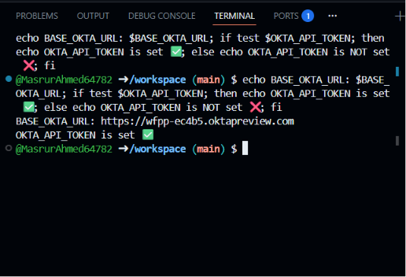
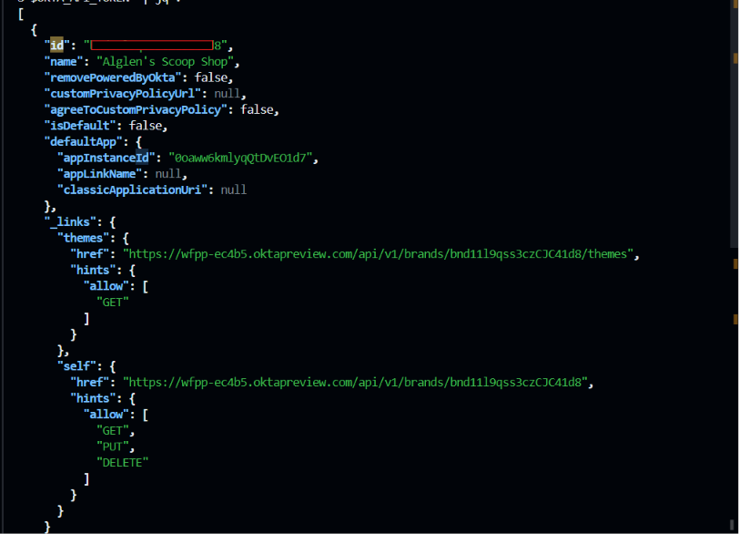
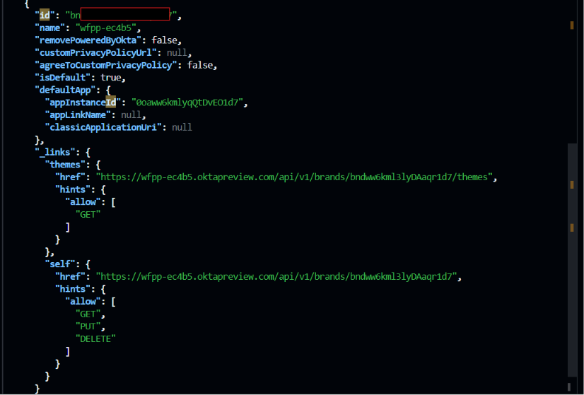
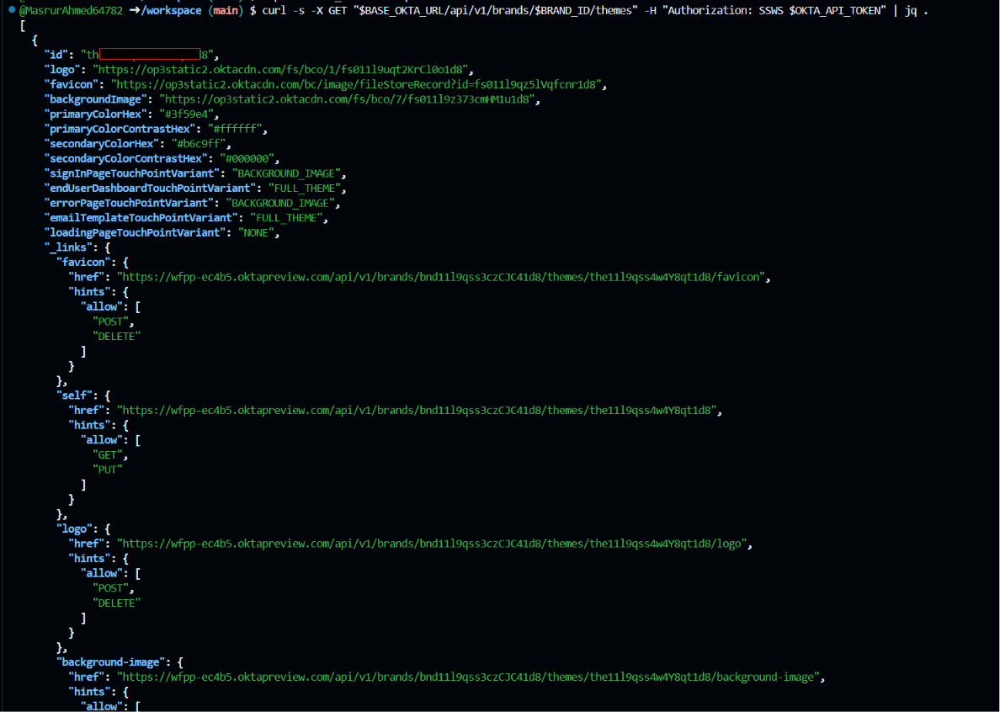
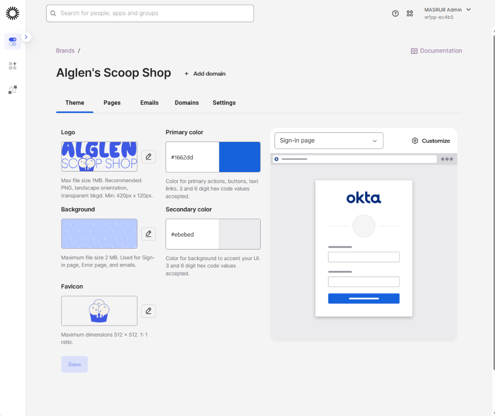
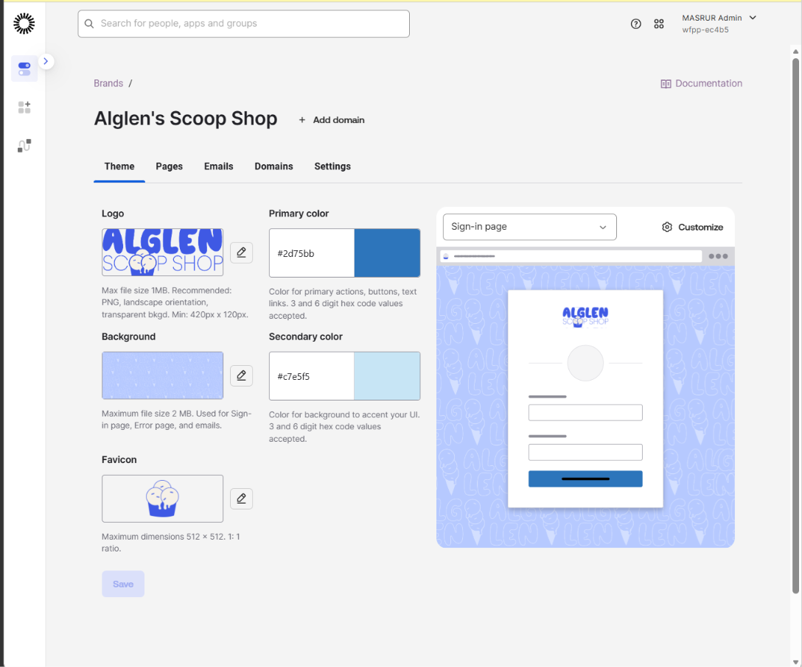

**Verification steps performed:**
1. Confirmed GitHub Codespaces secrets (`BASE_OKTA_URL`, `OKTA_API_TOKEN`) were correctly scoped to this lab's repository and resolved correctly in the terminal
2. Created the custom brand and confirmed it appeared alongside the org's default brand in the Admin Console
3. Applied full theme customization (logo, favicon, background, colors) and confirmed it rendered correctly in the Sign-in page preview
4. Retrieved both the brand list and the theme details via direct API calls, confirming the API response matched the Admin Console configuration
5. Performed a full theme replacement to Okta defaults via the API, and confirmed the change reflected immediately in the Admin Console
6. Restored the custom theme via a second API replacement call, and confirmed the original branding was back in the Admin Console

---

## Key Skills Demonstrated

- Okta Brands and Themes configuration via the Admin Console (Customizations → Brands)
- Custom logo, favicon, background, and color palette configuration for a branded identity experience
- Okta API token generation and secure secret management via GitHub Codespaces
- Direct interaction with the Okta Brands API (`GET /api/v1/brands`, `GET /api/v1/brands/{brandId}/themes`, `PUT /api/v1/brands/{brandId}/themes/{themeId}`)
- Understanding the distinction between partial UI-driven updates and full-replacement `PUT` API operations
- Cross-verification methodology: confirming API-driven changes by checking both the API response and the Admin Console UI

---

## Tools & Environment

- **Platform:** Okta (Okta Integrator Free Plan / Preview org)
- **Okta features used:** Customizations → Brands, Theme configuration, API Tokens, Brands API
- **Development environment:** GitHub Codespaces running `curl` and `jq` against the Okta Brands API
- **Test methodology:** Live API calls verified against Admin Console state, including a full reset-and-restore cycle to confirm the theme endpoint's replacement behavior

---

## Real-World Relevance

This pattern mirrors production IAM/branding workflows used to:

- Manage customer-facing branding as part of a broader identity or CIAM platform, with both a UI path for design teams and an API path for automation
- Back up and restore known-good branding configurations programmatically, reducing risk during rebrands or environment migrations
- Promote consistent branding across multiple environments (dev, staging, production) using API-driven configuration rather than manual re-entry
- Demonstrate the building blocks behind larger identity-as-code initiatives, where Okta configuration (branding, policies, apps) is version-controlled and applied via API rather than solely through the Admin Console

---

## Related Projects

- [Sign in Your Users and Secure Sessions with Okta](../sign-in-users-and-secure-sessions) — SPA integration, group-based RBAC, and the Redirect model of authentication
- [Okta Workflows — Use Helper Flows to Process Lists](../use-helper-flows-to-process-lists) — Time-based, self-expiring group access using event-driven flows and scheduled orchestration
- [Okta Network Security Policies](../network-security-policies) — IP Zones, Dynamic Zones, and Authentication Policy rules for context-aware access control

---

*Part of an ongoing IAM portfolio built using Okta Identity Engine.*
