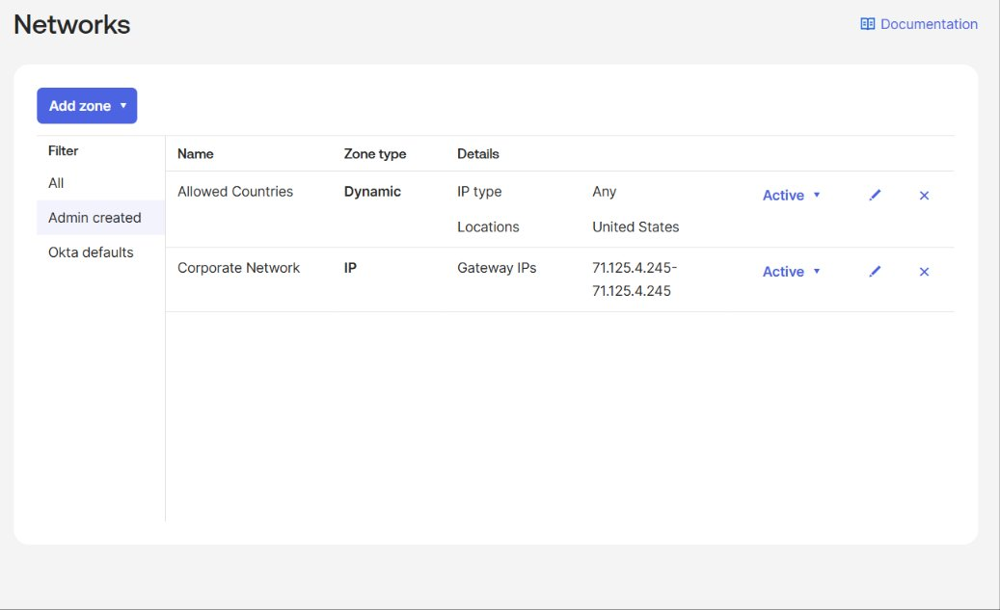
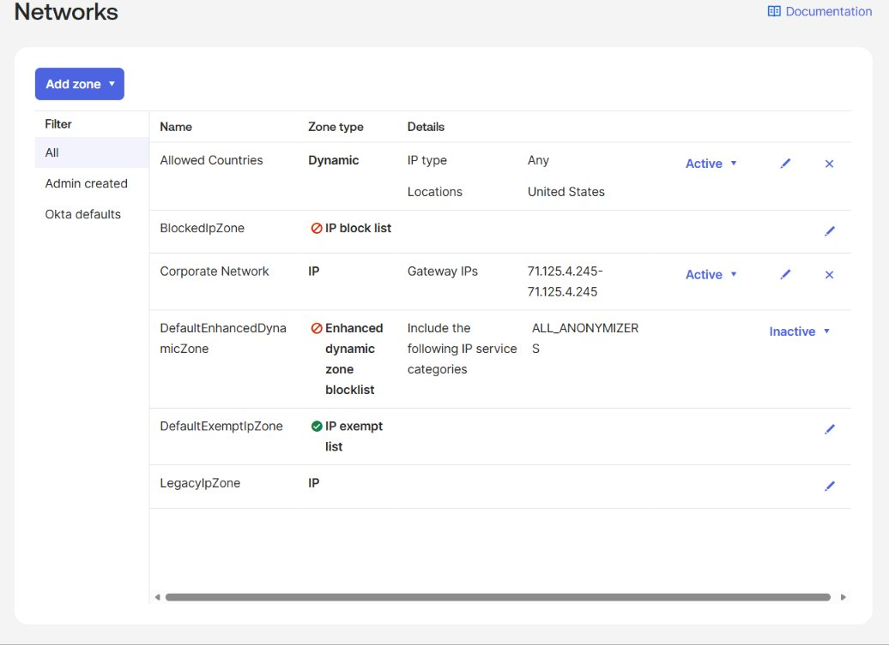
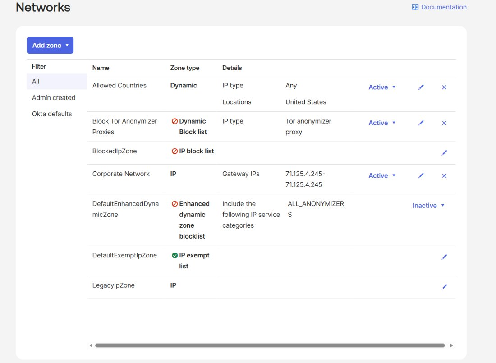
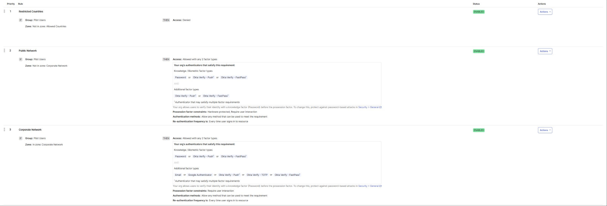

# Okta Network Security Policies

A hands-on IAM lab demonstrating how to configure and enforce network-based security policies in Okta using IP Zones, Dynamic Zones, and Authentication Policy rules.

---

## Overview

This project simulates a real-world enterprise security requirement: enforce different authentication requirements based on where a user is signing in from, and block access entirely from restricted or anonymous sources.

The lab was completed using an Okta Identity Engine org and covers three core network security scenarios organizations commonly implement.

---

## Business Problem

Organizations need to balance security and user experience based on network context:

- Employees signing in from the **corporate network** should have a streamlined but secure experience
- Employees signing in from **public networks** (home, coffee shop, etc.) require stronger authentication
- Access from **restricted countries** should be blocked entirely
- Access from **anonymous proxies** (Tor) should be blocked as a threat vector

This lab demonstrates how to configure all four scenarios in Okta.

---

## What I Built

### 1. IP Zone — Corporate Network
Created a named IP Zone defining the corporate network using gateway IP addresses. This zone is referenced in authentication policy rules to apply different requirements based on whether a user is on-premises or remote.

**Key concept:** IP Zones allow admins to define trusted network boundaries using specific IP addresses or CIDR ranges (up to 150 entries per zone).

### 2. Dynamic Zone — Allowed Countries
Created a Dynamic Zone using location-based conditions to define which countries are permitted to access the org. Used the System Log to identify the current sign-in country before configuring the zone.

**Key concept:** Dynamic Zones evaluate conditions like geography, ASN, and proxy type at runtime rather than matching static IPs — making them flexible for global policy enforcement.

### 3. Dynamic Zone — Block Tor Anonymizer Proxies
Created a Dynamic Zone specifically targeting Tor anonymizer proxy traffic and configured it to block access from any matching IP at the network level.

**Key concept:** Tor is frequently used to mask attacker origin. Blocking it at the zone level provides a proactive layer of defense before authentication policy rules are even evaluated.

---

## Network Zones — Final Configuration

All admin-created zones active in the org:

Full zone list including Okta defaults:

After adding the Tor anonymizer block zone:

---

## Authentication Policy Rules — Okta Dashboard

Added three ordered rules to the Okta Dashboard authentication policy, applied to a **Pilot Users** group for phased rollout:

| Priority | Rule | Condition | Outcome |
|---|---|---|---|
| 1 | Restricted Countries | IP not in Allowed Countries zone | Access Denied |
| 2 | Public Network | IP not in Corporate Network zone | Allowed — 2 factors required, hardware-protected possession factor |
| 3 | Corporate Network | IP in Corporate Network zone | Allowed — 2 factors required, possession factor with user interaction |

**Key distinctions:**
- Public Network rule requires a **hardware-protected** possession factor — this excludes TOTP (Okta Verify code) since TOTP is software-based
- Corporate Network rule allows **TOTP** as a valid possession factor — trusted network, slightly relaxed constraint
- **Phishing resistant was intentionally not enabled** to avoid over-restricting access during the pilot phase
- Rules are evaluated in **priority order** — a user denied by Rule 1 never reaches Rule 2 or 3

---

## Key Skills Demonstrated

- Okta Network Zone configuration (IP and Dynamic)
- Location-based and proxy-based access controls
- Authentication Policy rule creation and priority ordering
- Possession factor constraints (hardware-protected vs standard)
- Phased rollout using group-based policy scoping (Pilot Users group)
- System Log analysis to identify sign-in geography and verify policy enforcement
- Security principle of layered, context-aware access control (Zero Trust)

---

## Tools & Environment

- **Platform:** Okta Identity Engine (OIE)
- **Features used:** Security > Networks, Security > Authentication Policies, Security > Authenticators, Reports > System Log
- **Authenticators configured:** Okta Verify (TOTP, Push, FastPass)
- **Test methodology:** Incognito browser sessions with modified Corporate Network zone IPs to simulate public vs corporate network conditions

---

## Real-World Relevance

This configuration mirrors what IAM engineers implement in production environments to:

- Enforce **Zero Trust Network Access (ZTNA)** principles — never trust, always verify based on context
- Meet compliance requirements around **geographic access restrictions**
- Reduce risk from **compromised credentials** used outside trusted networks
- Support **phased security rollouts** without disrupting all users at once
- Block known threat vectors like **Tor anonymizers** at the infrastructure level

---

## Related Projects

- [Okta IAM Lifecycle Automation](#) — JML workflow automation using Okta Workflows and the Okta API
- [Okta SSO & SCIM Provisioning](#) — Enterprise SSO configuration with SAML/OIDC and automated provisioning

---

*Part of an ongoing IAM portfolio built using Okta Identity Engine. All labs completed in a provisioned Okta student environment.*
