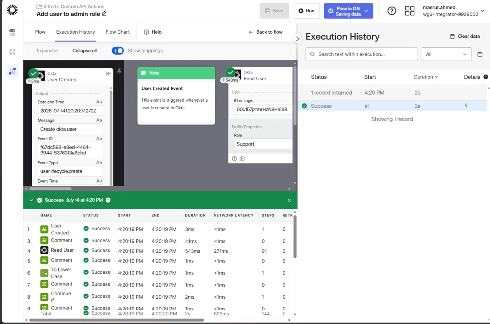
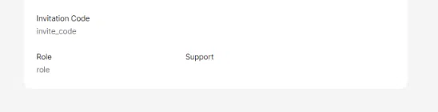
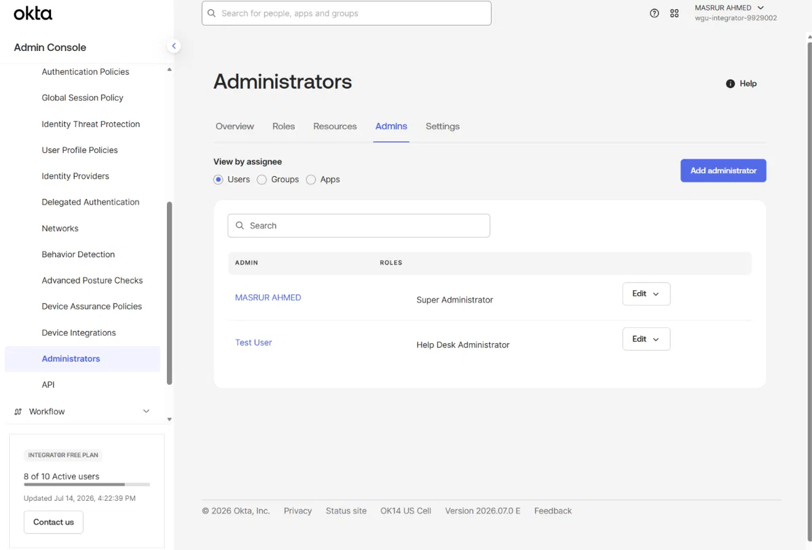

# Use Custom API Action (CAPIA) Cards

A hands-on Okta Workflows lab demonstrating how to call Okta API endpoints that have no dedicated pre-built connector action, using dynamically constructed HTTP requests.

---

## Overview

Okta Workflows ships with pre-built connector cards for the most common Okta operations, but not every API endpoint has one. This lab covers the escape hatch for that gap: the **Custom API Action (CAPIA)** card, which lets a flow construct and send an authenticated, arbitrary HTTP request to any Okta API endpoint.

The build uses CAPIA to solve a real gap — Okta Workflows has no built-in "assign admin role" connector action, so this flow constructs that API call by hand: a dynamic URL built from the user's ID, JSON headers, and a JSON body, then dispatches it as an authenticated `POST` request.

---

## Business Problem

Organizations often need to automate actions that fall outside what a platform's pre-built integration supports:

- A company tracks user role via a **custom profile attribute**, not a built-in Okta field
- New users with a specific role (e.g., "Support") should be **automatically granted a scoped admin role** (Help Desk Administrator) — without a human manually assigning it after every hire
- Okta Workflows' native Okta connector does not expose an "assign admin role" action, so this can't be done with a drag-and-drop card alone

This lab demonstrates how to bridge that gap using a raw, authenticated API call built entirely inside Workflows.

---

## What I Built

### 1. Custom Profile Attribute
Added a custom string attribute (`role`) to the default Okta user profile via the Profile Editor, used to track each user's functional role independent of Okta's built-in fields.

**Key concept:** Custom attributes extend the Okta user schema for organization-specific data that has no equivalent built-in field, and become available to Workflows the same way native profile fields are.

### 2. Event-Driven Flow — Add User to Admin Role
An event-driven flow that fires on **User Created**, reads the new user's full profile (including the custom `role` attribute), normalizes the value for case-insensitive comparison, and branches with a `Continue If` check — proceeding only if the role equals "support."

**Key concept:** Normalizing text (`To Lower Case`) before a conditional comparison avoids false negatives caused by inconsistent casing in source data — a common real-world data quality issue.

### 3. Dynamic Request Construction
Three composition steps build the pieces of the outbound API call before it's sent:
- **Compose (Text):** dynamically builds the relative URL (`/api/v1/users/{ID}/roles`) by interpolating the triggering user's ID
- **Construct (Object) — Headers:** builds a JSON header object specifying `Accept` and `Content-Type` as `application/json`
- **Construct (Object) — Body:** builds the JSON request body specifying the target role type (`HELP_DESK_ADMIN`)

**Key concept:** CAPIA cards don't know the shape of a specific API call in advance — the flow author is responsible for assembling the exact URL, headers, and body the target endpoint expects, based on that API's documentation.

### 4. Custom API Action — Add Role to User
The CAPIA card itself, configured with the composed relative URL, headers, and body, authenticated through the Okta Workflows OAuth connection with the additional `okta.roles.manage` and `okta.roles.read` API scopes granted and reauthorized.

**Key concept:** Granting a new Okta API Scope on the OAuth application is not sufficient on its own — any Workflows connection already using that app must be explicitly reauthorized before the new scope takes effect for that connection.

---

## Flow Architecture

```
Event: User Created
        │
        ▼
Read User (fetch full profile, including custom "role" attribute)
        │
        ▼
To Lower Case (normalize role value)
        │
        ▼
Continue If (role == "support")
        │
        ▼
Compose — API relative URL (/api/v1/users/{ID}/roles)
        │
        ▼
Construct — Headers (Accept, Content-Type)
        │
        ▼
Construct — Body (role type: HELP_DESK_ADMIN)
        │
        ▼
Custom API Action — Add Role to User (authenticated POST)
```

---

## Execution Verification

Tested end-to-end in a live Okta org using a dedicated test-user creation flow to trigger the automation:







**Verification steps performed:**
1. Ran a separate test flow to create a new Okta user with the custom `role` attribute set to `Support`
2. Confirmed the user was created successfully (`status: PROVISIONED`) via the raw API response
3. Confirmed the **Add user to admin role** flow triggered automatically off the `User Created` event and completed with every card showing Success
4. Confirmed directly in the Okta Admin Console — **Security > Administrators > Admins** — that the test user was assigned the **Help Desk Administrator** role, proving the raw API call succeeded

---

## Key Skills Demonstrated

- Constructing authenticated, arbitrary HTTP requests to Okta API endpoints with no dedicated Workflows connector action
- Dynamically composing request components (URL path interpolation, JSON headers, JSON body) from upstream flow data
- Managing Okta API Scopes at the OAuth application level and reauthorizing existing Workflows connections after scope changes
- Extending the Okta user schema with custom profile attributes via the Profile Editor
- Text normalization for reliable conditional branching on user-entered or externally sourced data
- Verifying automation outcomes against Okta's actual admin role assignment, not just flow execution status

---

## Tools & Environment

- **Platform:** Okta Workflows (Okta Identity Engine org)
- **Connectors used:** Okta (User Created event, Read User action), built-in Text, Branching, and Object functions, Custom API Action (CAPIA)
- **API scopes granted:** `okta.roles.manage`, `okta.roles.read`
- **Test methodology:** Dedicated test-user creation flow to trigger the event-driven automation, with verification against both the Workflows execution history and the live Okta Admin Console admin role assignment

---

## Real-World Relevance

This pattern mirrors production IAM automation used to:

- **Close integration gaps** when a platform's pre-built connectors don't cover every operation an organization needs to automate
- Automate **role-based access provisioning** at account creation, removing manual admin follow-up and reducing time-to-access for new hires
- Demonstrate the underlying mechanics that many "no-code" automation platforms abstract away — understanding how to construct a raw authenticated API call is a transferable skill across any workflow or iPaaS tool, not just Okta Workflows
- Reinforce the principle that **scope changes require reauthorization** — a frequent source of "it should be working" support tickets in production Workflows environments

---

## Related Projects

- [Use Helper Flows to Process Lists](../use-helper-flows-to-process-lists/) — Helper Flows, scheduled orchestration, and Tables for time-bound access automation
- [Okta Network Security Policies](../network-security-policies/) — IP Zones, Dynamic Zones, and Authentication Policy rules for context-aware access control
- [Okta IAM Lifecycle Automation](#) — JML workflow automation using Okta Workflows and the Okta API
- [Okta SSO & SCIM Provisioning](#) — Enterprise SSO configuration with SAML/OIDC and automated provisioning

---

*Part of an ongoing IAM portfolio built using Okta Identity Engine.*
