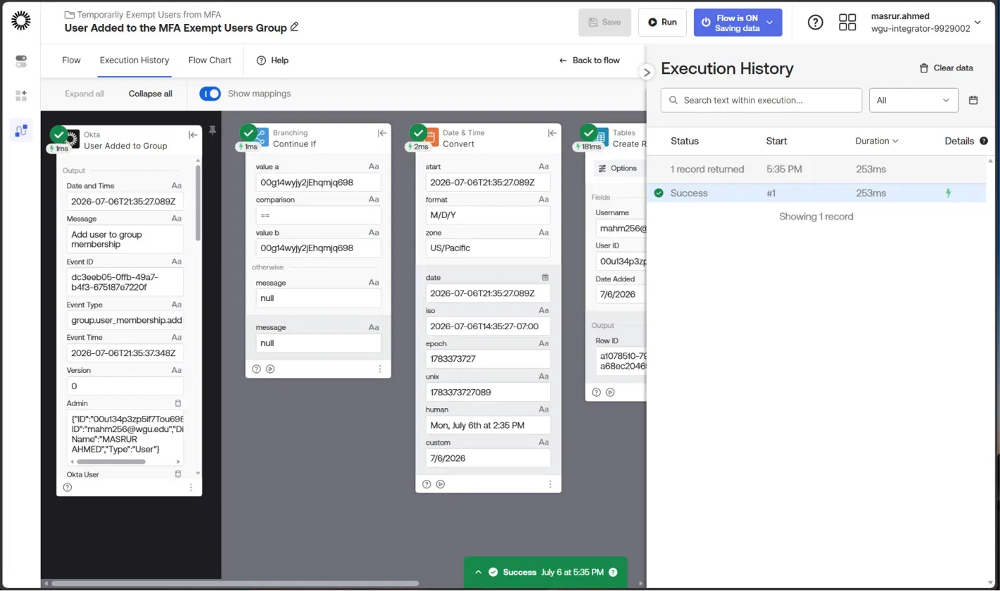
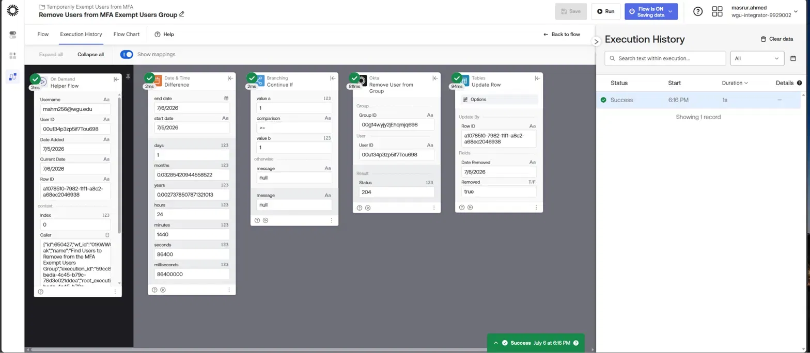
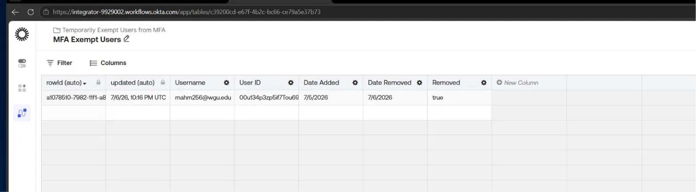
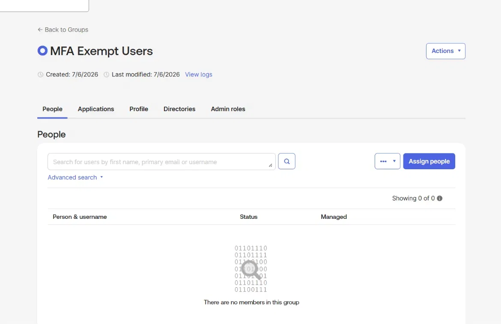

# Use Helper Flows to Process Lists

A hands-on Okta Workflows lab demonstrating time-based, self-expiring group access using event-driven flows, Helper Flows, and scheduled orchestration.

---

## Overview

This lab builds an automated system that temporarily exempts a user from MFA policies — for example, while they set up a new authenticator — and automatically revokes that exemption after 24 hours without any manual cleanup.

The build uses four interconnected Okta Workflows flows and demonstrates a reusable pattern: **event logging → stateful tracking → scheduled evaluation → conditional remediation**. This same pattern applies broadly across IAM automation, including time-bound access grants, temporary elevated permissions, and automated access reviews.

---

## Business Problem

Security teams frequently need to grant *temporary* relaxed access without leaving a standing exception in place:

- A user loses their MFA device and needs a short grace period to enroll a new one
- That grace period should **not** require manual admin follow-up to revoke
- The system needs an auditable record of who was exempted, when, and when they were removed
- Exemptions older than the allowed window must be automatically cleaned up, even if no one remembers to check

This lab demonstrates how to solve this entirely inside Okta Workflows, with no external scripting or scheduled jobs outside the platform.

---

## What I Built

### 1. Okta Connection
Authorized Okta Workflows to communicate with the Okta org using OAuth (Client ID/Secret from the Okta Workflows OAuth application), scoped with the necessary user and group read/manage permissions.

**Key concept:** Workflows connections rely on granted Okta API Scopes, not just app assignment — a connection can pass authentication and still fail to operate without the correct scopes granted.

### 2. Event-Driven Logging Flow — User Added to the MFA Exempt Users Group
An event-driven flow that listens for the **User Added to Group** event, filters for the specific MFA Exempt Users group by ID, and writes a new row to a custom Table recording the user's identity and the date they were added.

**Key concept:** Group-based events fire for *any* group in the org — a `Continue If` branch comparing the event's Group ID against the target group ID is required to scope the flow correctly.

### 3. Helper Flow — Remove Users from MFA Exempt Users Group
A reusable **Helper Flow** — a flow with no event or schedule trigger of its own, designed to be called by other flows. It receives a single user's tracked data (username, user ID, date added, current date, row ID), calculates the elapsed time using a `Difference` function, and if one day or more has passed, removes the user from the group via the Okta API and updates their table row to reflect the removal.

**Key concept:** Helper Flows decouple *decision logic* (should this user be removed?) from *orchestration logic* (which users need to be checked?), making the remediation logic independently testable and reusable across multiple calling flows.

### 4. Scheduled Orchestrator — Find Users to Remove from the MFA Exempt Users Group
A flow that runs daily on a schedule, searches the Table for every row not yet marked as removed, and uses a `For Each` loop to call the Helper Flow once per matching row — passing in that row's data for evaluation.

**Key concept:** Combining `Search Rows` (Tables) with `For Each` (List) lets a single scheduled flow safely process a variable-length list of pending records, rather than hardcoding logic for one user at a time.

---

## Flow Architecture

```
Event: User Added to Group
        │
        ▼
Continue If (Group ID match)
        │
        ▼
Convert (Date & Time)
        │
        ▼
Create Row → MFA Exempt Users Table
```

```
Schedule: Daily
        │
        ▼
Convert (Current Time)
        │
        ▼
Search Rows (Removed = false)
        │
        ▼
For Each row → calls Helper Flow
                     │
                     ▼
          Difference (days elapsed)
                     │
                     ▼
          Continue If (days ≥ 1)
                     │
                     ▼
          Remove User from Group (Okta API)
                     │
                     ▼
          Update Row (Removed = true, Date Removed)
```

---

## Execution Verification

All four flows tested end-to-end in a live Okta org, confirming the full automation loop functions correctly:









**Verification steps performed:**
1. Added a test account to the MFA Exempt Users group — confirmed the logging flow created a table row with `Removed = false`
2. Manually backdated the row's `Date Added` to simulate a 1+ day exemption window
3. Ran the scheduled orchestrator flow — confirmed it found the row, called the Helper Flow, and the Helper Flow removed the user from the Okta group and updated the row to `Removed = true`
4. Confirmed directly in the Okta Admin Console that group membership was empty post-removal

---

## Key Skills Demonstrated

- Okta Workflows event triggers, scheduled triggers, and Helper Flow (on-demand) triggers
- Branching logic with `Continue If` to scope event handling to specific resources
- Date & Time functions (`Convert`, `Difference`) for time-window calculations
- Tables as persistent state storage within Workflows (Create Row, Search Rows, Update Row)
- `For Each` iteration over dynamic, filtered lists of records
- Cross-flow orchestration by calling a Helper Flow from a parent flow with mapped input values
- Correctly distinguishing between similarly-named fields across nested objects (Admin ID vs. Okta User ID vs. Group ID) to avoid logic errors
- End-to-end testing methodology: simulating time passage by backdating test data, then verifying both the Workflows execution history and the downstream Okta state

---

## Tools & Environment

- **Platform:** Okta Workflows (Okta Identity Engine org)
- **Connectors used:** Okta (User Added to Group event, Remove User from Group action), Tables, built-in Schedule and Helper Flow triggers
- **Functions used:** Continue If (Branching), Convert & Difference (Date & Time), Create Row / Search Rows / Update Row (Tables), For Each (List)
- **Test methodology:** Live event triggering via group membership changes, manual table data manipulation to simulate elapsed time, and cross-verification between Workflows execution history and Okta Admin Console group state

---

## Real-World Relevance

This pattern mirrors production IAM automation used to:

- Grant **time-bound access exceptions** (MFA grace periods, temporary elevated permissions) without leaving standing risk
- Maintain an **auditable record** of every temporary access grant and its resolution
- Remove dependency on **manual admin follow-up** for time-sensitive access cleanup — a common source of access creep and audit findings
- Demonstrate the building blocks behind more complex **access review and certification automation**, where scheduled flows evaluate large sets of records against policy conditions

---

## Related Projects

- [Okta Network Security Policies](../okta-network-security-policies) — IP Zones, Dynamic Zones, and Authentication Policy rules for context-aware access control
- [Okta IAM Lifecycle Automation](#) — JML workflow automation using Okta Workflows and the Okta API
- [Okta SSO & SCIM Provisioning](#) — Enterprise SSO configuration with SAML/OIDC and automated provisioning

---

*Part of an ongoing IAM portfolio built using Okta Identity Engine.*
