# Project 01 — IAM Lifecycle Automation & Access Governance

---

## Business Problem

TechNova Inc. was managing employee access manually — IT had to create accounts, assign groups, and offboard users by hand using spreadsheets and helpdesk tickets. This created three critical risks:

- **Slow onboarding** — new hires waited days for access, killing productivity on day one
- **Access accumulation** — employees who changed roles retained old access, violating least privilege
- **Orphaned accounts** — terminated employees sometimes stayed active, creating insider threat and credential compromise risks

---

## Solution

Automated the full Joiner/Mover/Leaver (JML) identity lifecycle using Okta Workflows and Okta Identity Governance (OIG), eliminating manual intervention and enforcing least-privilege access automatically.

---

## Environment

| Detail | Value |
|--------|-------|
| Platform | Okta |
| Features Used | Okta Workflows, OIG, Okta Groups, Directory |
| Fictional Company | TechNova Inc. |
| Departments | Engineering, Human Resources, Sales |

---

## What I Built

### 1. Directory Structure & RBAC Foundation

Created a realistic employee directory with 6 test users across 3 departments, and 3 groups representing department-based access tiers.

**Groups created:**
- `Engineering-Staff`
- `HR-Staff`
- `Sales-Staff`

**Users created:**

| Name | Username | Department | Title |
|------|----------|------------|-------|
| James Carter | james.carter@technovainc.com | Engineering | Software Engineer |
| Priya Nair | priya.nair@technovainc.com | Engineering | DevOps Engineer |
| Marcus Webb | marcus.webb@technovainc.com | Human Resources | HR Generalist |
| Aisha Okonkwo | aisha.okonkwo@technovainc.com | Human Resources | HR Manager |
| Derek Huang | derek.huang@technovainc.com | Sales | Account Executive |
| Sofia Reyes | sofia.reyes@technovainc.com | Sales | Sales Manager |

---

### 2. Joiner Flow — Automated Onboarding

**The problem:** New hires had no access on day one unless IT manually assigned them to groups.

**What I built:** Used the Okta Workflows template "Manage Okta Group Membership Based on Profile Attributes" and adapted it to read the `Department` attribute from each user's profile. A Group Rules table maps department values to their corresponding Okta group.

**Group Rules Table:**

| Department | Group Assigned |
|------------|---------------|
| Engineering | Engineering-Staff |
| Human Resources | HR-Staff |
| Sales | Sales-Staff |

**Result:** Running the workflow for any user automatically assigns them to the correct group based on their Department attribute — zero manual steps.

**Flows enabled:**
- `[1.0] Fix Groups` — main orchestration flow
- `[1.1] CreateGroupList` — builds target group list
- `[s1.1.1] CreateListGroupsBasedOnUserAttribute` — maps attribute to groups
- `[1.2] Group Addition or Removal` — executes the add/remove action

**Screenshots:**

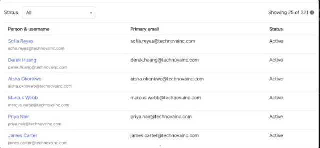
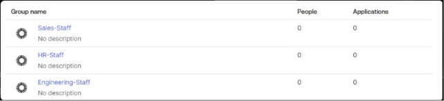
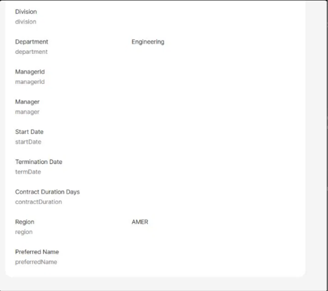
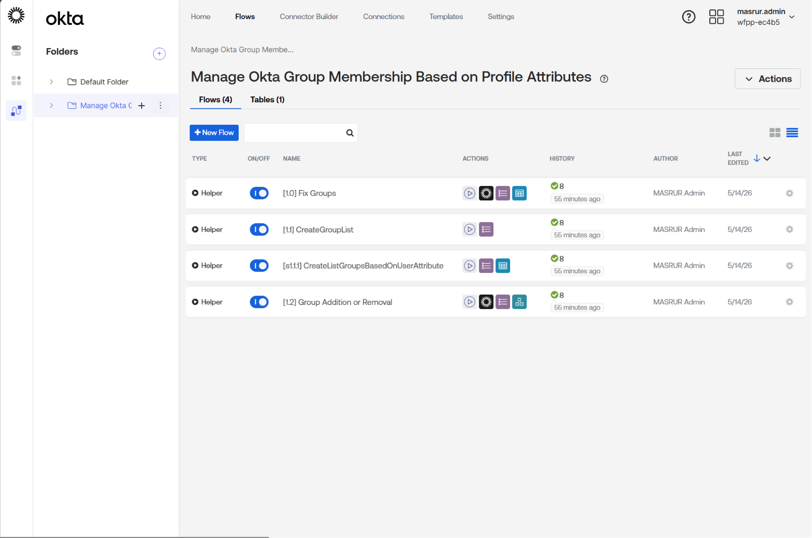

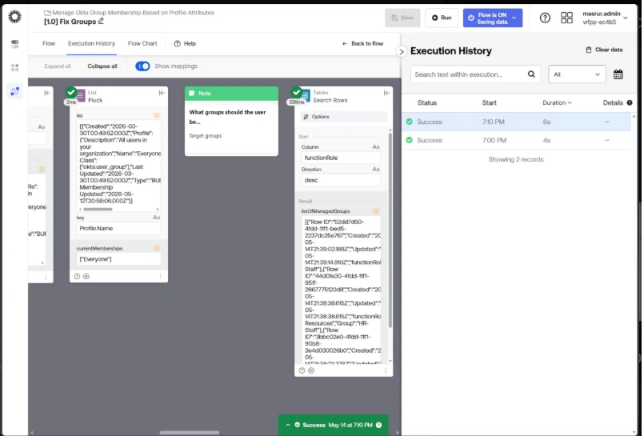

---

### 3. Mover Flow — Role Change Automation

**The scenario:** Derek Huang (Sales → Engineering promotion).

**What I did:** Updated Derek's `Department` attribute from `Sales` to `Engineering` and re-ran the Fix Groups workflow. The workflow automatically added him to `Engineering-Staff` and removed him from `Sales-Staff`.

**Result:** Access updated to reflect new role with no manual group assignment.

**Screenshots:**

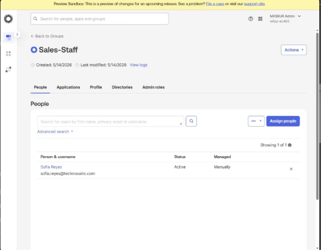

---

### 4. Leaver Flow — Automated Deprovisioning via Microsoft Graph API

**Design decision:** Originally scoped as app-assignment-driven deactivation (revoking Salesforce access to trigger downstream deprovisioning via SCIM), this required a live SCIM-connected backend not available in this free-tier lab. Pivoted to a direct Microsoft Graph API disable as the implemented approach.

**What I built:** A standalone Okta Workflow (`JML - Leaver (Terminate)`), triggered On Demand with a `displayName` input. The flow queries Microsoft Graph to locate the target user, then sends a `PATCH` request to disable their account (`accountEnabled: false`) — with a safety check that verifies exactly one user matches before allowing the disable to proceed.

**Bug found and fixed:** The Graph API `$filter` query parameter was initially sent as a stringified JSON blob instead of an actual query parameter, causing Graph to silently ignore the filter and return every user in the tenant. Since the flow took the first result by default, this disabled the wrong account. Fixed by rebuilding the filter as a proper query string fed directly into the connector's Query field, and added a match-count safety check as a result of this bug.

**Result:** Verified end-to-end — correctly disables the intended user only when exactly one match is found (confirmed via Entra ID account status: Enabled → Disabled), and correctly refuses to act when zero matches are found.

**Known limitation / future enhancement:** Currently triggered on-demand rather than automatically. A production version would use a Microsoft Graph webhook subscription or scheduled poll to detect disables in Entra and trigger the flow automatically.

**Screenshots:**

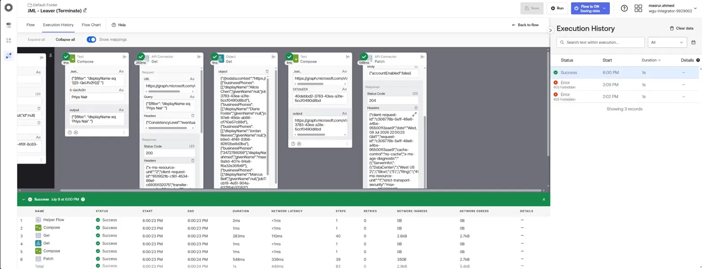
*Before fix: Query field returns all users instead of filtering to one — root cause of the wrong-user bug.*

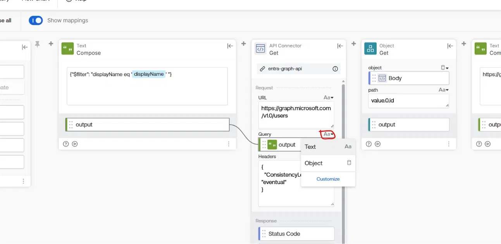
*Root cause: connector's Query field was set to Text mode, so the filter was never sent as a real query parameter.*

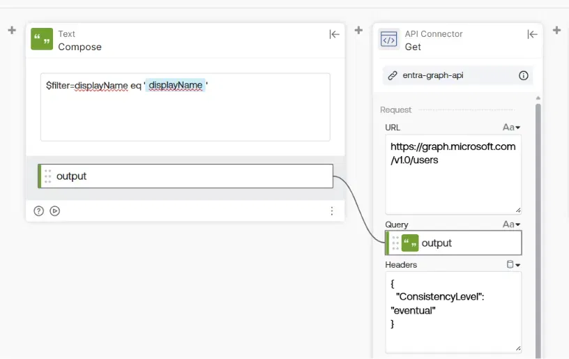
*Fix: Compose card rebuilt to output a proper query string, wired directly into the Query field.*

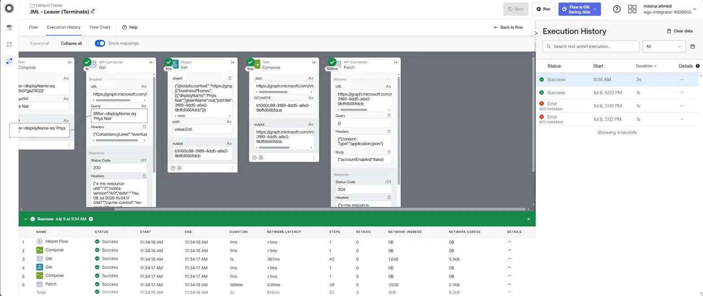
*After fix: Get card returns exactly one user (Priya Nair), Patch succeeds with a 204.*

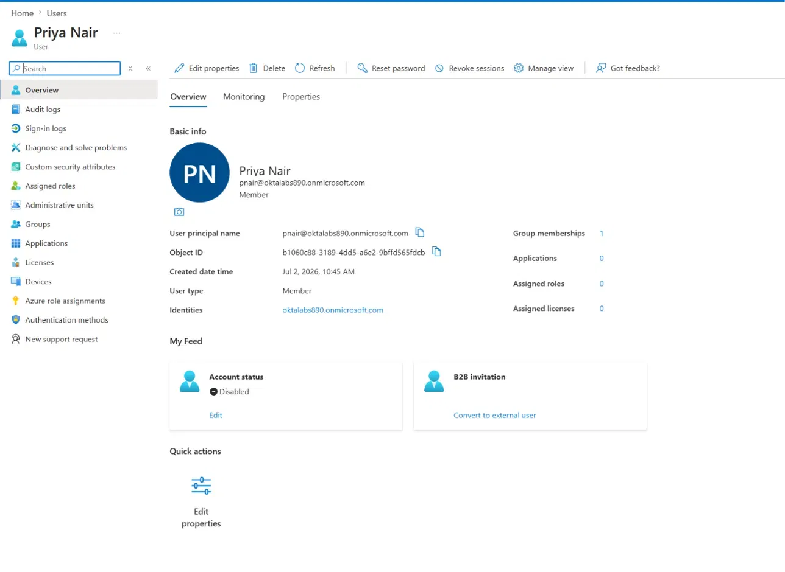
*Confirmed in Entra ID: Priya Nair's account status changed from Enabled to Disabled.*

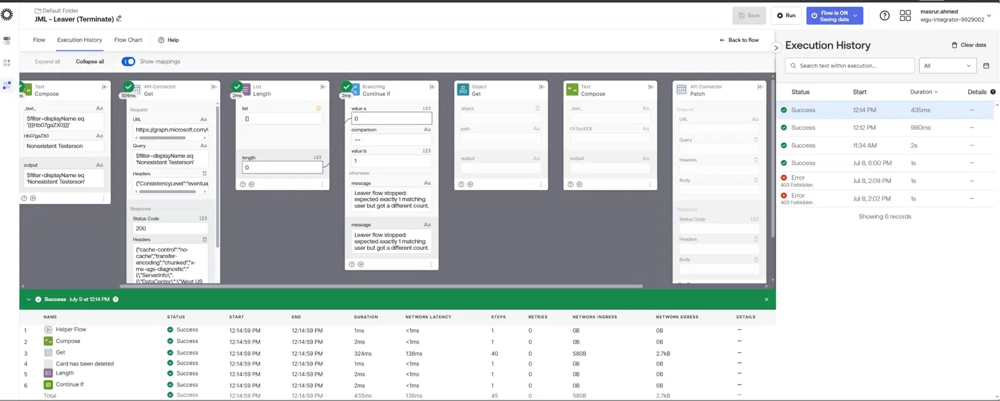
*Safety check test: a non-existent user returns zero matches, and the flow correctly stops instead of proceeding.*

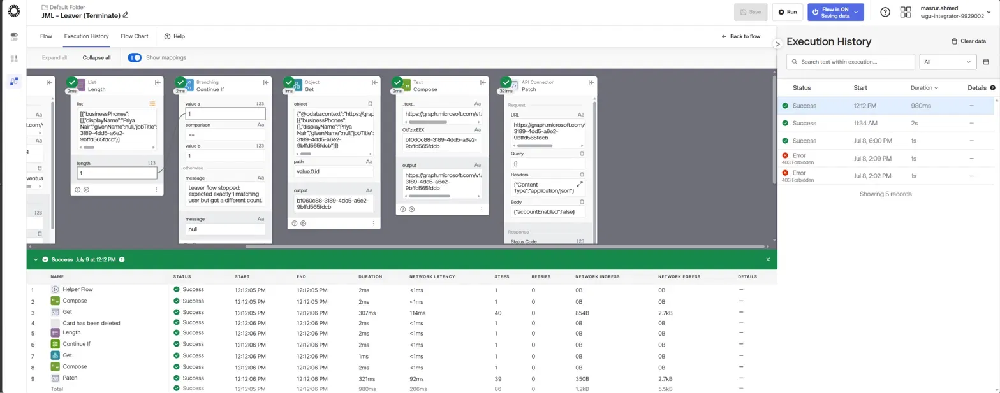
*Safety check test: a valid single match passes the check and the flow proceeds normally to disable the account.*

### 5. Access Governance — OIG Access Certifications

Okta Identity Governance (OIG) is enabled in this environment. Access Certifications allow managers to periodically review who has access to what and revoke access that is no longer appropriate — satisfying compliance requirements such as SOX and ISO 27001.

> Note: OIG Access Certifications require elevated admin permissions for campaign creation. The OIG module is confirmed enabled and the certification workflow is fully understood — reviewers are assigned, access items are presented for approval or revocation, and completed campaigns generate audit-ready reports.

**Screenshots:**

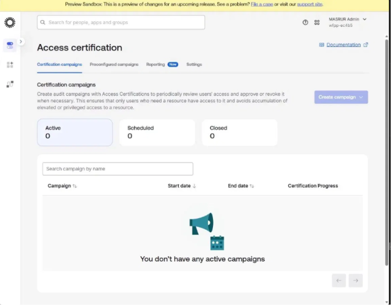

---

## Key Outcomes

| JML Stage | User | Action | Result |
|-----------|------|--------|--------|
| Joiner | All 6 users | Workflow run | Auto-assigned to correct department group |
| Mover | Derek Huang | Department changed Sales → Engineering | Moved to Engineering-Staff |
| Leaver | Priya Nair | Disabled via Graph API (on-demand trigger) | Status: Disabled, verified in Entra ID |

---

## Workflow Execution Evidence

- 8 successful workflow executions logged in Okta Workflows Execution History
- All executions completed in 4-9 seconds
- Audit trail available via Okta System Log

---

---

*Part of the [Okta IAM Portfolio](../../README.md)*
