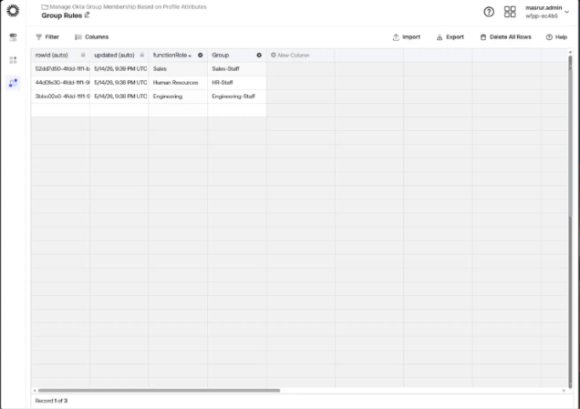
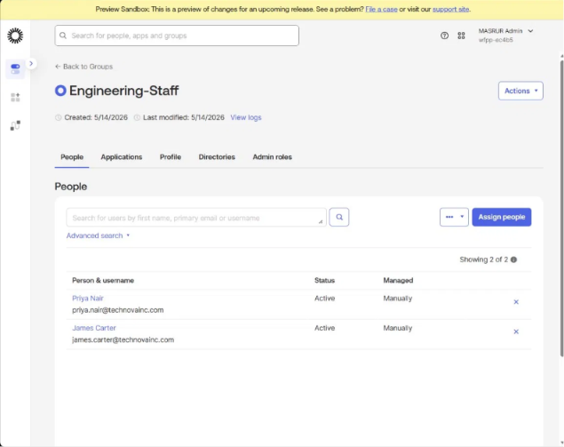
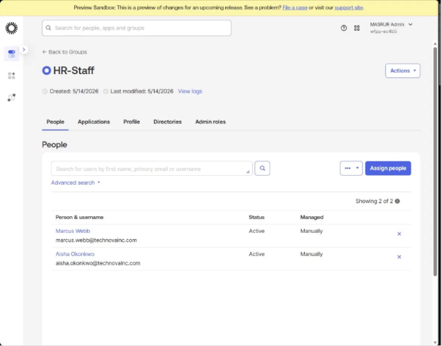
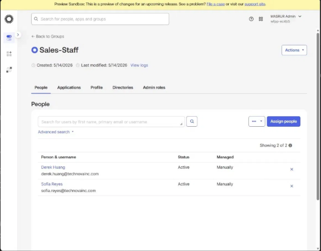
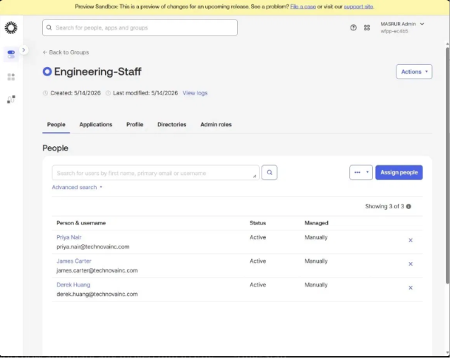
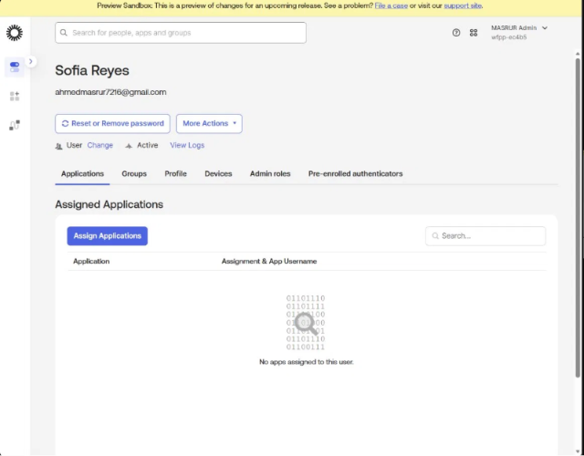
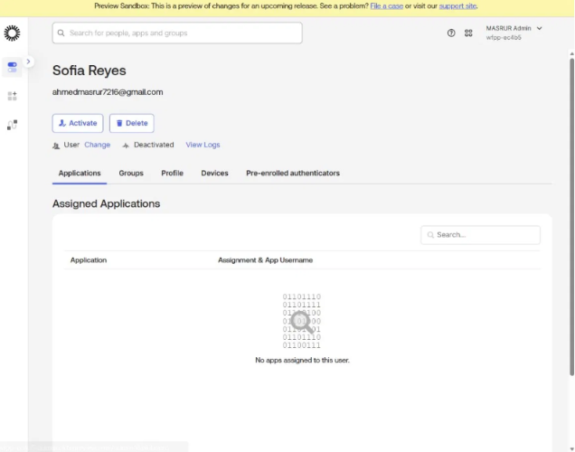

# Project 01 — IAM Lifecycle Automation & Access Governance

---

## Business Problem

TechNova Inc. was managing employee access manually — IT had to create accounts, assign groups, and offboard users by hand using spreadsheets and helpdesk tickets. This created three critical risks:

- **Slow onboarding** — new hires waited days for access, killing productivity on day one
- **Access accumulation** — employees who changed roles retained old access, violating least privilege
- **Orphaned accounts** — terminated employees sometimes stayed active, creating insider threat and credential compromise risks

---

## Solution

I automated the full Joiner/Mover/Leaver (JML) identity lifecycle using Okta Workflows and Okta Identity Governance (OIG), eliminating manual intervention and enforcing least-privilege access automatically.

---

## Environment

| Detail | Value |
|--------|-------|
| Platform | Okta (Student Lab) |
| Org | wfpp-ec4b5.oktapreview.com |
| Features Used | Okta Workflows, OIG, Okta Groups, Directory |
| Fictional Company | TechNova Inc. |
| Departments | Engineering, Human Resources, Sales |

---

## What I Built

### 1. Directory Structure & RBAC Foundation

Created a realistic employee directory with 6 test users across 3 departments, and 3 groups representing department-based access tiers.

**Groups created:**
- `Engineering-Staff`
- `HR-Staff`
- `Sales-Staff`

**Users created:**

| Name | Username | Department | Title |
|------|----------|------------|-------|
| James Carter | james.carter@technovainc.com | Engineering | Software Engineer |
| Priya Nair | priya.nair@technovainc.com | Engineering | DevOps Engineer |
| Marcus Webb | marcus.webb@technovainc.com | Human Resources | HR Generalist |
| Aisha Okonkwo | aisha.okonkwo@technovainc.com | Human Resources | HR Manager |
| Derek Huang | derek.huang@technovainc.com | Sales | Account Executive |
| Sofia Reyes | sofia.reyes@technovainc.com | Sales | Sales Manager |

---

### 2. Joiner Flow — Automated Onboarding

**The problem:** New hires had no access on day one unless IT manually assigned them to groups.

**What I built:** Used the Okta Workflows template "Manage Okta Group Membership Based on Profile Attributes" and adapted it to read the `Department` attribute from each user's profile. A Group Rules table maps department values to their corresponding Okta group.

**Group Rules Table:**

| Department | Group Assigned |
|------------|---------------|
| Engineering | Engineering-Staff |
| Human Resources | HR-Staff |
| Sales | Sales-Staff |

**Result:** Running the workflow for any user automatically assigns them to the correct group based on their Department attribute — zero manual steps.

**Flows enabled:**
- `[1.0] Fix Groups` — main orchestration flow
- `[1.1] CreateGroupList` — builds target group list
- `[s1.1.1] CreateListGroupsBasedOnUserAttribute` — maps attribute to groups
- `[1.2] Group Addition or Removal` — executes the add/remove action

---

### 3. Mover Flow — Role Change Automation

**The scenario:** Derek Huang (Sales → Engineering promotion).

**What I did:** Updated Derek's `Department` attribute from `Sales` to `Engineering` and re-ran the Fix Groups workflow. The workflow automatically added him to `Engineering-Staff` and he was removed from `Sales-Staff`.

**Result:** Access updated to reflect new role with no manual group assignment.

---

### 4. Leaver Flow — Secure Offboarding

**The scenario:** Sofia Reyes leaves TechNova.

**What I did:** Deactivated Sofia's Okta account immediately via the Admin Console.

**Result:** Account status changed from `Active` to `Deactivated` — all access revoked instantly. No orphaned account risk.

**Why this matters:** Every minute between termination and deactivation is a security window. Orphaned accounts are one of the most common findings in security audits and a frequent attacker entry point.

---

### 5. Access Governance — OIG Access Certifications

Okta Identity Governance (OIG) is enabled in this lab environment. Access Certifications allow managers to periodically review who has access to what and revoke access that is no longer appropriate — satisfying compliance requirements such as SOX and ISO 27001.

> Note: Campaign creation required elevated admin permissions not available in the student lab. The OIG module is confirmed enabled and the certification workflow is understood — reviewers are assigned, access items are presented for approval or revocation, and completed campaigns generate audit-ready reports.

---

## Key Outcomes

| JML Stage | User | Action | Result |
|-----------|------|--------|--------|
| Joiner | All 6 users | Workflow run | Auto-assigned to correct department group |
| Mover | Derek Huang | Department changed Sales → Engineering | Moved to Engineering-Staff |
| Leaver | Sofia Reyes | Account deactivated | Status: Deactivated, access revoked |

---

## Workflow Execution Evidence

- 8 successful workflow executions logged in Okta Workflows Execution History
- All executions completed in 4-9 seconds
- Audit trail available via Okta System Log

---

## Interview Talking Points

- **Why a lookup table instead of hardcoded logic?** Scalability — adding a new department requires only a new table row, not touching the workflow itself
- **What happens if Department is missing?** The workflow finds no match and assigns no group — highlighting the importance of data quality in IAM (garbage in, garbage out)
- **How would you prove this to an auditor?** Okta Workflows Execution History provides timestamped logs of every run — who was affected, what action was taken, and when
- **What's the risk of delayed offboarding?** Orphaned accounts are active credentials with no legitimate owner — a primary target for attackers and a common audit finding

---

## Screenshots

 
 
 
 
 
 
 
 
 
 
 
 
 
 
